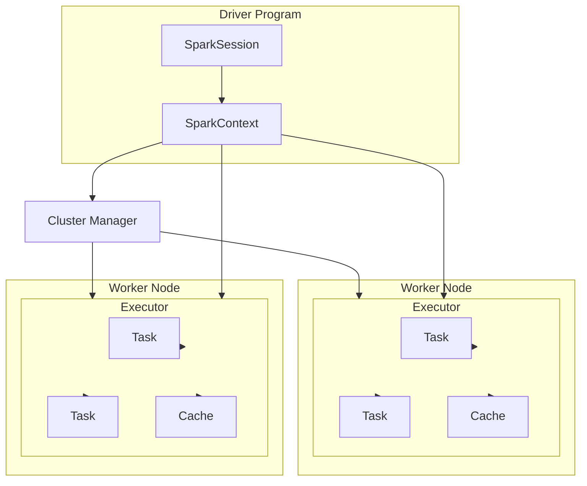
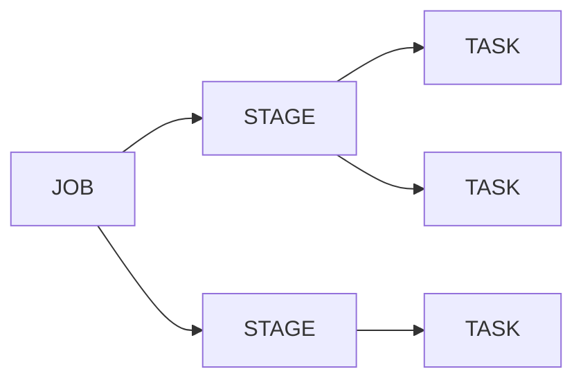
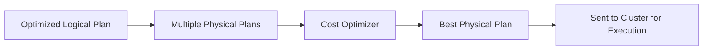

+++
title = "Spark"
weight = -1
+++


## What is Spark?

**Spark** is an open source unified computing engine with a set of libraries for **parallel data processing** on a computer cluster.

It supports widely used programming languages such as:

- **Scala**
- **Python**
- **Java**
- **R**

It processes data in **memory (RAM)**, which makes it 100 times faster than traditional Hadoop MapReduce.



### Spark Components

Following represents Spark components at a high level:
- Low Level API – RDD & Distributed Variables
- Structured API – DataFrames, Datasets, and SQL
- Libraries and Ecosystem – Structured Streaming and Advanced Analytics

LAYER STRUCTURE
|:----------------------:|
| Libraries & Ecosystem  |
| Structured API         |
| Low Level API          |

## How Spark Works

### 1. Drivers and Executors
- **Driver**: The brain of a Spark application. It translates your code into a logical execution plan and coordinates work.  
- **Executors**: The workers. They run on cluster nodes, do the actual computation, and store data in memory/disk.  

Think of the **Driver as a manager** and **Executors as employees** doing the tasks.  

---

### 2. Jobs, Stages, and Tasks
- **Job**: Triggered when you call an action (like `.collect()` or `.save()`). A job = big unit of work.  
- **Stage**: Spark splits the job into smaller parts based on shuffle boundaries (data movement points).  
- **Task**: The smallest unit. Each stage is broken into many tasks, one per partition of data.  

👉 Flow: **Job → Stages → Tasks → Results**



## What is Partition?

To allow every executor to work in parallel, Spark breaks down the data into chunks called partitions.

## What is Transformation?
The **instruction** or **code** to modify and transform data is known as Transformation.

**Examples**: select,where,groupBy etc.

Transformation helps in building the **logical plan**.

Two Types:
- **Narrow Transformation**
- **Wide Transformation**

## What are Actions?
To **trigger the execution** we need to call an **Action**.

This basically executes the plan created by Transformation.

Actions are of three types:
- **View data** in console
- **Collect data** to native language
- **Write data** to output data sources

### Spark prefers Lazy Evaluation

**Transformations are lazy** → Spark doesn’t execute them immediately; it just builds a logical plan (DAG).
**Execution happens only on actions** → When an action (collect, count, save) is called, Spark optimizes the DAG and runs it.

### Shuffle in Spark
- **When**: Happens during **wide transformations** (`groupByKey`, `reduceByKey`, `join`, etc.).
- **What**: Data is **redistributed across the cluster** so records with the same key end up in the same partition.  
- **Impact**: A **new stage** is created in the DAG because shuffle requires data movement across executors.


> Shuffling occurs because wide transformations require **related data (e.g., same keys)** to be co-located in the **same partition**, which necessitates **repartitioning** and **redistributing** data across nodes.

> [!NOTE]
> In Spark, **actions (like count, collect, saveAsTextFile) create a job and trigger its execution, wide transformations (such as groupByKey, reduceByKey, join) introduce shuffle boundaries by redistributing data across partitions, and these boundaries split the job into stages, where tasks are scheduled and executed in parallel on cluster nodes.**


## What is Spark Session?

- The Driver Process is known as Spark Session.
- It is the entry point for a Spark execution.
- The Spark Session instance executes the code in the cluster.
- The relation is one-to-one, i.e., for one Spark Application, there will be one Spark Session instance.

### Structured API - DataFrames

- DataFrame is the most common Structured API, represented like a table.
- The table is represented in form of Rows and Columns.
- DataFrame has schema, which is the metadata for the columns.
- Data in DataFrames are in partitions.
- DataFrames are immutable.

> [!NOTE]
> DataFrames are **immutable**, meaning every transformation creates a **new DataFrame** without altering the original one.
### Structured API Execution Plan
### 1. **Logial Planning**
The Spark **Driver** first converts your code (Transformations/Actions) into a **logical plan**.
Represents **what** needs to be done without worrying about **how** it will be executed.

### 2. **Physical Planning**
Spark converts the **logical plan** into a **physical plan**, deciding **how** to execute it (which operations run where, partitioning, joins, etc.).
Optimizes for performance (e.g., choosing sort merge join vs broadcast join).



### 3. DAG (Directed Acyclic Graph)

Spark breaks the physical plan into a **DAG of stages**.
Shows **dependencies between stages** and ensures tasks are executed in the correct order.

**Flow**: DAG → Stages → Tasks → Execution

--- 

### Summary Flow


## Creating a Spark Session in PySpark

A **SparkSession** is the entry point to using PySpark. It allows interaction with Spark’s functionalities (DataFrame, SQL, etc.).

### Example
```python
from pyspark.sql import SparkSession

spark = (
    SparkSession
    .builder
    .appName("Spark Introduction")
    .master("local[*]")
    .getOrCreate()
)
```

- `SparkSession.builder`: used to configure the session.
- `.appName("...")`: sets the application name.
- `.master("local[*]")`: runs Spark locally using all CPU cores.
- `.getOrCreate()`: returns an existing session or creates a new one.

**Note**:In Databricks, you don’t need to create a SparkSession manually. A spark session is already available by default, so you can directly use spark.read, spark.sql, etc.

## Creating DataFrames in PySpark

### 1. From In-Memory Data
You can create a DataFrame directly from Python objects (lists, tuples, dicts).

```python
data = [("Alice", 25), ("Bob", 30), ("Charlie", 35)]
columns = ["Name", "Age"]

df = spark.createDataFrame(data, columns)
df.show()
```

### 2. From File

You can load data from CSV, JSON, Parquet, etc.

```python
df = spark.read.csv("path/to/file.csv", header=True, inferSchema=True)
df.show()
df = spark.read.json("path/to/file.json")
df.show()
```


## 01 Spark Session
```python
# Spark Session
from pyspark.sql import SparkSession

spark = (
    SparkSession
    .builder
    .appName("Spark Introduction")
    .master("local[*]")
    .getOrCreate()
)
```

```python
spark
```

```python
# Emp Data & Schema

emp_data = [
    ["001","101","John Doe","30","Male","50000","2015-01-01"],
    ["002","101","Jane Smith","25","Female","45000","2016-02-15"],
    ["003","102","Bob Brown","35","Male","55000","2014-05-01"],
    ["004","102","Alice Lee","28","Female","48000","2017-09-30"],
    ["005","103","Jack Chan","40","Male","60000","2013-04-01"],
    ["006","103","Jill Wong","32","Female","52000","2018-07-01"],
    ["007","101","James Johnson","42","Male","70000","2012-03-15"],
    ["008","102","Kate Kim","29","Female","51000","2019-10-01"],
    ["009","103","Tom Tan","33","Male","58000","2016-06-01"],
    ["010","104","Lisa Lee","27","Female","47000","2018-08-01"],
    ["011","104","David Park","38","Male","65000","2015-11-01"],
    ["012","105","Susan Chen","31","Female","54000","2017-02-15"],
    ["013","106","Brian Kim","45","Male","75000","2011-07-01"],
    ["014","107","Emily Lee","26","Female","46000","2019-01-01"],
    ["015","106","Michael Lee","37","Male","63000","2014-09-30"],
    ["016","107","Kelly Zhang","30","Female","49000","2018-04-01"],
    ["017","105","George Wang","34","Male","57000","2016-03-15"],
    ["018","104","Nancy Liu","29","Female","50000","2017-06-01"],
    ["019","103","Steven Chen","36","Male","62000","2015-08-01"],
    ["020","102","Grace Kim","32","Female","53000","2018-11-01"]
]

emp_schema = "employee_id string, department_id string, name string, age string, gender string, salary string, hire_date string"
```

```python
# Create emp DataFrame

emp = spark.createDataFrame(data=emp_data, schema=emp_schema)
```

```python
# Check number of partitions

emp.rdd.getNumPartitions()
```

```python
# Show data (ACTION)

emp.show()
```

```python
# Write our first Transformation (EMP salary > 50000)

emp_final = emp.where("salary > 50000")
```

```python
# Validate number of Partitions

emp_final.rdd.getNumPartitions()
```

```python
# Write data as CSV output (ACTION)

emp_final.write.format("csv").save("data/output/1/emp.csv")
```

 

## 02 Basic Transformations 1
```python
# Spark Session
from pyspark.sql import SparkSession

spark = (
    SparkSession
    .builder
    .appName("Basic Transformation - I")
    .master("local[*]")
    .getOrCreate()
)

spark
```

```python
# Emp Data & Schema

emp_data = [
    ["001","101","John Doe","30","Male","50000","2015-01-01"],
    ["002","101","Jane Smith","25","Female","45000","2016-02-15"],
    ["003","102","Bob Brown","35","Male","55000","2014-05-01"],
    ["004","102","Alice Lee","28","Female","48000","2017-09-30"],
    ["005","103","Jack Chan","40","Male","60000","2013-04-01"],
    ["006","103","Jill Wong","32","Female","52000","2018-07-01"],
    ["007","101","James Johnson","42","Male","70000","2012-03-15"],
    ["008","102","Kate Kim","29","Female","51000","2019-10-01"],
    ["009","103","Tom Tan","33","Male","58000","2016-06-01"],
    ["010","104","Lisa Lee","27","Female","47000","2018-08-01"],
    ["011","104","David Park","38","Male","65000","2015-11-01"],
    ["012","105","Susan Chen","31","Female","54000","2017-02-15"],
    ["013","106","Brian Kim","45","Male","75000","2011-07-01"],
    ["014","107","Emily Lee","26","Female","46000","2019-01-01"],
    ["015","106","Michael Lee","37","Male","63000","2014-09-30"],
    ["016","107","Kelly Zhang","30","Female","49000","2018-04-01"],
    ["017","105","George Wang","34","Male","57000","2016-03-15"],
    ["018","104","Nancy Liu","29","Female","50000","2017-06-01"],
    ["019","103","Steven Chen","36","Male","62000","2015-08-01"],
    ["020","102","Grace Kim","32","Female","53000","2018-11-01"]
]

emp_schema = "employee_id string, department_id string, name string, age string, gender string, salary string, hire_date string"
```

```python
# Create emp DataFrame

emp = spark.createDataFrame(data=emp_data, schema=emp_schema)
```

```python
# Show emp dataframe (ACTION)

emp.show()
```

```python
# Schema for emp

emp.schema
```

```python
# Small Example for Schema
from pyspark.sql.types import StructType, StructField, StringType, IntegerType
schema_string = "name string, age int"

schema_spark =  StructType([
    StructField("name", StringType(), True),
    StructField("age", IntegerType(), True)
])
```

```python
# Columns and expression
from pyspark.sql.functions import col, expr

emp["salary"]

```

```python
# SELECT columns
# select employee_id, name, age, salary from emp

emp_filtered = emp.select(col("employee_id"), expr("name"), emp.age, emp.salary)
```

```python
# SHOW Dataframe (ACTION)

emp_filtered.show()
```

```python
# Using expr for select
# select employee_id as emp_id, name, cast(age as int) as age, salary from emp_filtered

emp_casted = emp_filtered.select(expr("employee_id as emp_id"), emp.name, expr("cast(age as int) as age"), emp.salary)
```

```python
# SHOW Dataframe (ACTION)

emp_casted.show()
```

```python
emp_casted_1 = emp_filtered.selectExpr("employee_id as emp_id", "name", "cast(age as int) as age", "salary")
```

```python
emp_casted_1.show()
```

```python
emp_casted.printSchema()
```

```python
# Filter emp based on Age > 30
# select emp_id, name, age, salary from emp_casted where age > 30

emp_final = emp_casted.select("emp_id", "name", "age", "salary").where("age > 30")
```

```python
# SHOW Dataframe (ACTION)

emp_final.show()
```

```python
# Write the data back as CSV (ACTION)

emp_final.write.format("csv").save("data/output/2/emp.csv")
```

```python
# Bonus TIP

schema_str = "name string, age int"

from pyspark.sql.types import _parse_datatype_string

schema_spark = _parse_datatype_string(schema_str)

schema_spark
```

 

## 03 Basic Transformations 2
```python
# Spark Session
from pyspark.sql import SparkSession

spark = (
    SparkSession
    .builder
    .appName("Basic Transformation - II")
    .master("local[*]")
    .getOrCreate()
)

spark
```

```python
# Emp Data & Schema

emp_data = [
    ["001","101","John Doe","30","Male","50000","2015-01-01"],
    ["002","101","Jane Smith","25","Female","45000","2016-02-15"],
    ["003","102","Bob Brown","35","Male","55000","2014-05-01"],
    ["004","102","Alice Lee","28","Female","48000","2017-09-30"],
    ["005","103","Jack Chan","40","Male","60000","2013-04-01"],
    ["006","103","Jill Wong","32","Female","52000","2018-07-01"],
    ["007","101","James Johnson","42","Male","70000","2012-03-15"],
    ["008","102","Kate Kim","29","Female","51000","2019-10-01"],
    ["009","103","Tom Tan","33","Male","58000","2016-06-01"],
    ["010","104","Lisa Lee","27","Female","47000","2018-08-01"],
    ["011","104","David Park","38","Male","65000","2015-11-01"],
    ["012","105","Susan Chen","31","Female","54000","2017-02-15"],
    ["013","106","Brian Kim","45","Male","75000","2011-07-01"],
    ["014","107","Emily Lee","26","Female","46000","2019-01-01"],
    ["015","106","Michael Lee","37","Male","63000","2014-09-30"],
    ["016","107","Kelly Zhang","30","Female","49000","2018-04-01"],
    ["017","105","George Wang","34","Male","57000","2016-03-15"],
    ["018","104","Nancy Liu","29","Female","50000","2017-06-01"],
    ["019","103","Steven Chen","36","Male","62000","2015-08-01"],
    ["020","102","Grace Kim","32","Female","53000","2018-11-01"]
]

emp_schema = "employee_id string, department_id string, name string, age string, gender string, salary string, hire_date string"
```

```python
# Create emp DataFrame

emp = spark.createDataFrame(data=emp_data, schema=emp_schema)
```

```python
# Show emp dataframe (ACTION)

emp.show()
```

```python
# Print Schema

emp.printSchema()
```

```python
# Casting Column
# select employee_id, name, age, cast(salary as double) as salary from emp
from pyspark.sql.functions import col, cast

emp_casted = emp.select("employee_id", "name", "age", col("salary").cast("double"))

```

```python
emp_casted.printSchema()
```

```python
# Adding Columns
# select employee_id, name, age, salary, (salary * 0.2) as tax from emp_casted

emp_taxed = emp_casted.withColumn("tax", col("salary") * 0.2)
```

```python
emp_taxed.show()
```

```python
# Literals
# select employee_id, name, age, salary, tax, 1 as columnOne, 'two' as columnTwo from emp_taxed
from pyspark.sql.functions import lit

emp_new_cols = emp_taxed.withColumn("columnOne", lit(1)).withColumn("columnTwo", lit('two'))

```

```python
emp_new_cols.show()
```

```python
# Renaming Columns
# select employee_id as emp_id, name, age, salary, tax, columnOne, columnTwo from emp_new_cols

emp_1 = emp_new_cols.withColumnRenamed("employee_id", "emp_id")
```

```python
emp_1.show()
```

```python
# Column names with Spaces
# select employee_id as emp_id, name, age, salary, tax, columnOne, columnTwo as `Column Two` from emp_new_cols

emp_2 = emp_new_cols.withColumnRenamed("columnTwo", "Column Two")
```

```python
emp_2.show()
```

```python
# Remove Column

emp_dropped = emp_new_cols.drop("columnTwo", "columnOne")
```

```python
emp_dropped.show()
```

```python
# Filter data 
# select employee_id as emp_id, name, age, salary, tax, columnOne from emp_col_dropped where tax > 1000

emp_filtered = emp_dropped.where("tax > 10000")
```

```python
emp_filtered.show()
```

```python
# LIMIT data
# select employee_id as emp_id, name, age, salary, tax, columnOne from emp_filtered limit 5

emp_limit = emp_filtered.limit(5)
```

```python
# Show data

emp_limit.show(2)
```

```python
# Bonus TIP
# Add multiple columns

columns = {
    "tax" : col("salary") * 0.2 ,
    "oneNumber" : lit(1), 
    "columnTwo" : lit("two")
}

emp_final = emp.withColumns(columns)
```

```python
emp_final.show()
```


## 04 String And Dates
```python
# Spark Session
from pyspark.sql import SparkSession

spark = (
    SparkSession
    .builder
    .appName("Working with Strings & Dates")
    .master("local[*]")
    .getOrCreate()
)

spark
```

```python
# Emp Data & Schema

emp_data = [
    ["001","101","John Doe","30","Male","50000","2015-01-01"],
    ["002","101","Jane Smith","25","Female","45000","2016-02-15"],
    ["003","102","Bob Brown","35","Male","55000","2014-05-01"],
    ["004","102","Alice Lee","28","Female","48000","2017-09-30"],
    ["005","103","Jack Chan","40","Male","60000","2013-04-01"],
    ["006","103","Jill Wong","32","Female","52000","2018-07-01"],
    ["007","101","James Johnson","42","Male","70000","2012-03-15"],
    ["008","102","Kate Kim","29","Female","51000","2019-10-01"],
    ["009","103","Tom Tan","33","Male","58000","2016-06-01"],
    ["010","104","Lisa Lee","27","Female","47000","2018-08-01"],
    ["011","104","David Park","38","Male","65000","2015-11-01"],
    ["012","105","Susan Chen","31","Female","54000","2017-02-15"],
    ["013","106","Brian Kim","45","Male","75000","2011-07-01"],
    ["014","107","Emily Lee","26","Female","46000","2019-01-01"],
    ["015","106","Michael Lee","37","Male","63000","2014-09-30"],
    ["016","107","Kelly Zhang","30","Female","49000","2018-04-01"],
    ["017","105","George Wang","34","Male","57000","2016-03-15"],
    ["018","104","Nancy Liu","29","","50000","2017-06-01"],
    ["019","103","Steven Chen","36","Male","62000","2015-08-01"],
    ["020","102","Grace Kim","32","Female","53000","2018-11-01"]
]

emp_schema = "employee_id string, department_id string, name string, age string, gender string, salary string, hire_date string"
```

```python
# Create emp DataFrame

emp = spark.createDataFrame(data=emp_data, schema=emp_schema)
```

```python
# Show emp dataframe (ACTION)

emp.show()
```

```python
# Print Schema

emp.printSchema()
```

```python
# Case When
# select employee_id, name, age, salary, gender,
# case when gender = 'Male' then 'M' when gender = 'Female' then 'F' else null end as new_gender, hire_date from emp
from pyspark.sql.functions import when, col, expr

emp_gender_fixed = emp.withColumn("new_gender", when(col("gender") == 'Male', 'M')
                                 .when(col("gender") == 'Female', 'F')
                                 .otherwise(None)
                                 )
                            
emp_gender_fixed_1 = emp.withColumn("new_gender", expr("case when gender = 'Male' then 'M' when gender = 'Female' then 'F' else null end"))
```

```python
emp_gender_fixed_1.show()
```

```python
# Replace in Strings
# select employee_id, name, replace(name, 'J', 'Z') as new_name, age, salary, gender, new_gender, hire_date from emp_gender_fixed
from pyspark.sql.functions import regexp_replace

emp_name_fixed = emp_gender_fixed.withColumn("new_name", regexp_replace(col("name"), "J", "Z"))

```

```python
emp_name_fixed.show()
```

```python
# Convert Date
# select *,  to_date(hire_date, 'YYYY-MM-DD') as hire_date from emp_name_fixed
from pyspark.sql.functions import to_date

emp_date_fix = emp_name_fixed.withColumn("hire_date", to_date(col("hire_date"), 'yyyy-MM-dd'))

```

```python
emp_date_fix.printSchema()
```

```python
# Add Date Columns
# Add current_date, current_timestamp, extract year from hire_date
from pyspark.sql.functions import current_date, current_timestamp

emp_dated = emp_date_fix.withColumn("date_now", current_date()).withColumn("timestamp_now", current_timestamp())

```

```python
emp_dated.show(truncate=False)
```

```python
# Drop Null gender records
emp_1 = emp_dated.na.drop()

```

```python
emp_1.show()
```

```python
# Fix Null values
# select *, nvl('new_gender', 'O') as new_gender from emp_dated
from pyspark.sql.functions import coalesce, lit

emp_null_df = emp_dated.withColumn("new_gender", coalesce(col("new_gender"), lit("O")))

```

```python
emp_null_df.show()
```

```python
# Drop old columns and Fix new column names
emp_final = emp_null_df.drop("name", "gender").withColumnRenamed("new_name", "name").withColumnRenamed("new_gender", "gender")

```

```python
emp_final.show()
```

```python
# Write data as CSV
emp_final.write.format("csv").save("data/output/4/emp.csv")

```

```python
# Bonus TIP
# Convert date into String and extract date information
from pyspark.sql.functions import date_format

emp_fixed = emp_final.withColumn("date_year", date_format(col("timestamp_now"), "z"))


```

```python
emp_fixed.show()
```

 

## 05 Sort Union Aggregation
```python
# Spark Session
from pyspark.sql import SparkSession

spark = (
    SparkSession
    .builder
    .appName("Sort Union & Aggregation")
    .master("local[*]")
    .getOrCreate()
)

spark
```

```python
# Emp Data & Schema

emp_data_1 = [
    ["001","101","John Doe","30","Male","50000","2015-01-01"],
    ["002","101","Jane Smith","25","Female","45000","2016-02-15"],
    ["003","102","Bob Brown","35","Male","55000","2014-05-01"],
    ["004","102","Alice Lee","28","Female","48000","2017-09-30"],
    ["005","103","Jack Chan","40","Male","60000","2013-04-01"],
    ["006","103","Jill Wong","32","Female","52000","2018-07-01"],
    ["007","101","James Johnson","42","Male","70000","2012-03-15"],
    ["008","102","Kate Kim","29","Female","51000","2019-10-01"],
    ["009","103","Tom Tan","33","Male","58000","2016-06-01"],
    ["010","104","Lisa Lee","27","Female","47000","2018-08-01"]
]

emp_data_2 = [
    ["011","104","David Park","38","Male","65000","2015-11-01"],
    ["012","105","Susan Chen","31","Female","54000","2017-02-15"],
    ["013","106","Brian Kim","45","Male","75000","2011-07-01"],
    ["014","107","Emily Lee","26","Female","46000","2019-01-01"],
    ["015","106","Michael Lee","37","Male","63000","2014-09-30"],
    ["016","107","Kelly Zhang","30","Female","49000","2018-04-01"],
    ["017","105","George Wang","34","Male","57000","2016-03-15"],
    ["018","104","Nancy Liu","29","","50000","2017-06-01"],
    ["019","103","Steven Chen","36","Male","62000","2015-08-01"],
    ["020","102","Grace Kim","32","Female","53000","2018-11-01"]
]

emp_schema = "employee_id string, department_id string, name string, age string, gender string, salary string, hire_date string"
```

```python
# Create emp DataFrame

emp_data_1 = spark.createDataFrame(data=emp_data_1, schema=emp_schema)
emp_data_2 = spark.createDataFrame(data=emp_data_2, schema=emp_schema)
```

```python
# Show emp dataframe (ACTION)

emp_data_1.show()
emp_data_2.show()
```

```python
# Print Schema

emp_data_1.printSchema()
emp_data_2.printSchema()
```

```python
# UNION and UNION ALL
# select * from emp_data_1 UNION select * from emp_data_2
emp = emp_data_1.unionAll(emp_data_2)

```

```python
emp.show()
```

```python
# Sort the emp data based on desc Salary
# select * from emp order by salary desc
from pyspark.sql.functions import desc, asc, col

emp_sorted = emp.orderBy(col("salary").asc())


```

```python
emp_sorted.show()
```

```python
# Aggregation
# select dept_id, count(employee_id) as total_dept_count from emp_sorted group by dept_id 
from pyspark.sql.functions import count

emp_count = emp_sorted.groupBy("department_id").agg(count("employee_id").alias("total_dept_count"))

```

```python
emp_count.show()
```

```python
# Aggregation
# select dept_id, sum(salary) as total_dept_salary from emp_sorted group by dept_id 
from pyspark.sql.functions import sum

emp_sum = emp_sorted.groupBy("department_id").agg(sum("salary").alias("total_dept_salary"))

```

```python
emp_sum.show()
```

```python
# Aggregation with having clause
# select dept_id, avg(salary) as avg_dept_salary from emp_sorted  group by dept_id having avg(salary) > 50000
from pyspark.sql.functions import avg

emp_avg = emp_sorted.groupBy("department_id").agg(avg("salary").alias("avg_dept_salary")).where("avg_dept_salary > 50000")


```

```python
emp_avg.show()
```

```python
# Bonus TIP - unionByName
# In case the column sequence is different
emp_data_2_other = emp_data_2.select("employee_id", "salary", "department_id", "name", "hire_date", "gender", "age")

emp_data_1.printSchema()
emp_data_2_other.printSchema()


```

```python
emp_fixed = emp_data_1.unionByName(emp_data_2_other)
```

```python
emp_fixed.show()
```

```python
emp.count()
```

 

## 06 Unique Data And Window
```python
# Spark Session
from pyspark.sql import SparkSession

spark = (
    SparkSession
    .builder
    .appName("Unique data & Window Functions")
    .master("local[*]")
    .getOrCreate()
)

spark
```

```python
# Emp Data & Schema

emp_data = [
    ["001","101","John Doe","30","Male","50000","2015-01-01"],
    ["002","101","Jane Smith","25","Female","45000","2016-02-15"],
    ["003","102","Bob Brown","35","Male","55000","2014-05-01"],
    ["004","102","Alice Lee","28","Female","48000","2017-09-30"],
    ["005","103","Jack Chan","40","Male","60000","2013-04-01"],
    ["006","103","Jill Wong","32","Female","52000","2018-07-01"],
    ["007","101","James Johnson","42","Male","70000","2012-03-15"],
    ["008","102","Kate Kim","29","Female","51000","2019-10-01"],
    ["009","103","Tom Tan","33","Male","58000","2016-06-01"],
    ["010","104","Lisa Lee","27","Female","47000","2018-08-01"],
    ["011","104","David Park","38","Male","65000","2015-11-01"],
    ["012","105","Susan Chen","31","Female","54000","2017-02-15"],
    ["013","106","Brian Kim","45","Male","75000","2011-07-01"],
    ["014","107","Emily Lee","26","Female","46000","2019-01-01"],
    ["015","106","Michael Lee","37","Male","63000","2014-09-30"],
    ["016","107","Kelly Zhang","30","Female","49000","2018-04-01"],
    ["017","105","George Wang","34","Male","57000","2016-03-15"],
    ["018","104","Nancy Liu","29","","50000","2017-06-01"],
    ["019","103","Steven Chen","36","Male","62000","2015-08-01"],
    ["020","102","Grace Kim","32","Female","53000","2018-11-01"]
]

emp_schema = "employee_id string, department_id string, name string, age string, gender string, salary string, hire_date string"
```

```python
# Create emp DataFrame

emp = spark.createDataFrame(data=emp_data, schema=emp_schema)
```

```python
# Show emp dataframe (ACTION)

emp.show()
```

```python
# Print Schema

emp.printSchema()
```

```python
# Get unique data
# select distinct emp.* from emp
emp_unique = emp.distinct()


```

```python
emp_unique.show()
```

```python
# Unique of department_ids
# select distinct department_id from emp
emp_dept_id = emp.select("department_id").distinct()

```

```python
emp_dept_id.show()
```

```python
# Window Functions
# select *, max(salary) over(partition by department_id order by salary desc) as max_salary from emp_unique
from pyspark.sql.window import Window
from pyspark.sql.functions import max, col, desc

window_spec = Window.partitionBy(col("department_id")).orderBy(col("salary").desc())
max_func = max(col("salary")).over(window_spec)

emp_1 = emp.withColumn("max_salary", max_func)


```

```python
emp_1.show()

# Window Functions - 2nd highest salary of each department
# select *, row_number() over(partition by department_id order by salary desc) as rn from emp_unique where rn = 2
from pyspark.sql.window import Window
from pyspark.sql.functions import row_number, desc, col

window_spec = Window.partitionBy(col("department_id")).orderBy(col("salary").desc())
rn = row_number().over(window_spec)

emp_2 = emp.withColumn("rn", rn).where("rn = 2")


```

```python
emp_2.show()
```

```python
# Window function using expr
# select *, row_number() over(partition by department_id order by salary desc) as rn from emp_unique where rn = 2
from pyspark.sql.functions import expr

emp_3 = emp.withColumn("rn", expr("row_number() over(partition by department_id order by salary desc)")).where("rn = 2")


```

```python
emp_3.show()
```

```python
# Bonus TIP
# Databricks community cloud
```

## 07 Joins And Data Partitions
```python
# Spark Session
from pyspark.sql import SparkSession

spark = (
    SparkSession
    .builder
    .appName("Joins and Data Partitions")
    .master("local[*]")
    .getOrCreate()
)

spark
```

```python
# Emp Data & Schema

emp_data = [
    ["001","101","John Doe","30","Male","50000","2015-01-01"],
    ["002","101","Jane Smith","25","Female","45000","2016-02-15"],
    ["003","102","Bob Brown","35","Male","55000","2014-05-01"],
    ["004","102","Alice Lee","28","Female","48000","2017-09-30"],
    ["005","103","Jack Chan","40","Male","60000","2013-04-01"],
    ["006","103","Jill Wong","32","Female","52000","2018-07-01"],
    ["007","101","James Johnson","42","Male","70000","2012-03-15"],
    ["008","102","Kate Kim","29","Female","51000","2019-10-01"],
    ["009","103","Tom Tan","33","Male","58000","2016-06-01"],
    ["010","104","Lisa Lee","27","Female","47000","2018-08-01"],
    ["011","104","David Park","38","Male","65000","2015-11-01"],
    ["012","105","Susan Chen","31","Female","54000","2017-02-15"],
    ["013","106","Brian Kim","45","Male","75000","2011-07-01"],
    ["014","107","Emily Lee","26","Female","46000","2019-01-01"],
    ["015","106","Michael Lee","37","Male","63000","2014-09-30"],
    ["016","107","Kelly Zhang","30","Female","49000","2018-04-01"],
    ["017","105","George Wang","34","Male","57000","2016-03-15"],
    ["018","104","Nancy Liu","29","","50000","2017-06-01"],
    ["019","103","Steven Chen","36","Male","62000","2015-08-01"],
    ["020","102","Grace Kim","32","Female","53000","2018-11-01"]
]

emp_schema = "employee_id string, department_id string, name string, age string, gender string, salary string, hire_date string"

dept_data = [
    ["101", "Sales", "NYC", "US", "1000000"],
    ["102", "Marketing", "LA", "US", "900000"],
    ["103", "Finance", "London", "UK", "1200000"],
    ["104", "Engineering", "Beijing", "China", "1500000"],
    ["105", "Human Resources", "Tokyo", "Japan", "800000"],
    ["106", "Research and Development", "Perth", "Australia", "1100000"],
    ["107", "Customer Service", "Sydney", "Australia", "950000"]
]

dept_schema = "department_id string, department_name string, city string, country string, budget string"
```

```python
# Create emp & dept DataFrame

emp = spark.createDataFrame(data=emp_data, schema=emp_schema)
dept = spark.createDataFrame(data=dept_data, schema=dept_schema)
```

```python
# Show emp dataframe (ACTION)

emp.show()
dept.show()
```

```python
# Print Schema

emp.printSchema()
dept.printSchema()
```

```python
# Get number of partitions for emp
emp.rdd.getNumPartitions()
```

```python
# Get number of partitions for dept
dept.rdd.getNumPartitions()
```

```python
# Repartition of data using repartition & coalesce
emp_partitioned = emp.repartition(4, "department_id")
```

```python
emp_partitioned.rdd.getNumPartitions()
```

```python
# Find the partition info for partitions and reparition
from pyspark.sql.functions import spark_partition_id

emp_1 = emp.repartition(4, "department_id").withColumn("partition_num", spark_partition_id())

```

```python
emp_1.show()
```

```python
# INNER JOIN datasets
# select e.emp_name, d.department_name, d.department_id, e.salary 
# from emp e inner join dept d on emp.department_id = dept.department_id

df_joined = emp.alias("e").join(dept.alias("d"), how="inner", on=emp.department_id==dept.department_id)
```

```python
df_joined.select("e.name", "d.department_id", "d.department_name", "e.salary").show()
```

```python
# LEFT OUTER JOIN datasets
# select e.emp_name, d.department_name, d.department_id, e.salary 
# from emp e left outer join dept d on emp.department_id = dept.department_id

df_joined = emp.alias("e").join(dept.alias("d"), how="left_outer", on=emp.department_id==dept.department_id)
```

```python
df_joined.select("e.name", "d.department_name", "d.department_id", "e.salary").show()
```

```python
# Write the final dataset
df_joined.select("e.name", "d.department_name", "d.department_id","e.salary").write.format("csv").save("data/output/7/emp_joined.csv")
```

```python
# Bonus TIP
# Joins with cascading conditions
# Join with Department_id and only for departments 101 or 102
# Join with not null/null conditions

df_final = emp.join(dept, how="left_outer", 
                   on=(emp.department_id==dept.department_id) & ((emp.department_id == "101") | (emp.department_id == "102")) 
                    & (emp.salary.isNull())
                   )

```

```python
df_final.show()
```

 

## 08 Reading From Csv Files
```python
# Spark Session
from pyspark.sql import SparkSession

spark = (
    SparkSession
    .builder
    .appName("Reading from CSV Files")
    .master("local[*]")
    .getOrCreate()
)

spark
```

```python
# Read a csv file into dataframe

df = spark.read.format("csv").option("header", True).option("inferSchema", True).load("data/input/emp.csv")

```

```python
df.printSchema()
```

```python
df.show()
```

```python
# Reading with Schema
_schema = "employee_id int, department_id int, name string, age int, gender string, salary double, hire_date date"

df_schema = spark.read.format("csv").option("header",True).schema(_schema).load("data/input/emp.csv")

```

```python
df_schema.show()
```

```python
# Handle BAD records - PERMISSIVE (Default mode)

_schema = "employee_id int, department_id int, name string, age int, gender string, salary double, hire_date date, bad_record string"

df_p = spark.read.format("csv").schema(_schema).option("columnNameOfCorruptRecord", "bad_record").option("header", True).load("data/input/emp_new.csv")

```

```python
df_p.printSchema()
```

```python
df_p.show()
```

```python
# Handle BAD records - DROPMALFORMED
_schema = "employee_id int, department_id int, name string, age int, gender string, salary double, hire_date date"

df_m = spark.read.format("csv").option("header", True).option("mode", "DROPMALFORMED").schema(_schema).load("data/input/emp_new.csv")

```

```python
df_m.printSchema()
```

```python
df_m.show()
```

```python
# Handle BAD records - FAILFAST

_schema = "employee_id int, department_id int, name string, age int, gender string, salary double, hire_date date"

df_m = spark.read.format("csv").option("header", True).option("mode", "FAILFAST").schema(_schema).load("data/input/emp_new.csv")


```

```python
df_m.printSchema()
```

```python
df_m.show()
```

```python
# BONUS TIP
# Multiple options

_options = {
    "header" : "true",
    "inferSchema" : "true",
    "mode" : "PERMISSIVE"
}

df = (spark.read.format("csv").options(**_options).load("data/input/emp.csv"))

```

```python
df.show()
```

```python
spark.stop()
```

 

## 09 Reading Complex Data Formats
```python
# Spark Session
from pyspark.sql import SparkSession

spark = (
    SparkSession
    .builder
    .appName("Reading Complex Data Formats")
    .master("local[*]")
    .getOrCreate()
)

spark
```

```python
# Read Parquet Sales data

df_parquet = spark.read.format("parquet").load("data/input/sales_total_parquet/*.parquet")
```

```python
df_parquet.printSchema()
```

```python
df_parquet.show()
```

```python
# Read ORC Sales data

df_orc = spark.read.format("orc").load("data/input/sales_total_orc/*.orc")
```

```python
df_orc.printSchema()
```

```python
df_orc.show()
```

```python
# Benefits of Columnar Storage

# Lets create a simple Python decorator - {get_time} to get the execution timings
# If you dont know about Python decorators - check out : https://www.geeksforgeeks.org/decorators-in-python/
import time

def get_time(func):
    def inner_get_time() -> str:
        start_time = time.time()
        func()
        end_time = time.time()
        return (f"Execution time: {(end_time - start_time)*1000} ms")
    print(inner_get_time())
```

```python
@get_time
def x():
    df = spark.read.format("parquet").load("data/input/sales_data.parquet")
    df.count()
```

```python
@get_time
def x():
    df = spark.read.format("parquet").load("data/input/sales_data.parquet")
    df.select("trx_id").count()
```

 

```python
# BONUS TIP
# RECURSIVE READ

sales_recursive
|__ sales_1\1.parquet
|__ sales_1\sales_2\2.parquet


```

```python
df_1 = spark.read.format("parquet").load("data/input/sales_recursive/sales_1/1.parquet")
df_1.show()
```

```python
df_1 = spark.read.format("parquet").load("data/input/sales_recursive/sales_1/sales_2/2.parquet")
df_1.show()
```

```python
df_1 = spark.read.format("parquet").option("recursiveFileLookup", True).load("data/input/sales_recursive/")
df_1.show()
```

 

## 10 Read Json Files
```python
# Spark Session
from pyspark.sql import SparkSession

spark = (
    SparkSession
    .builder
    .appName("Reading and Parsing JSON Files/Data")
    .master("local[*]")
    .getOrCreate()
)

spark
```

```python
# Read Single line JSON file

df_single = spark.read.format("json").load("data/input/order_singleline.json")
```

```python
df_single.printSchema()
```

```python
df_single.show()
```

```python
# Read Multiline JSON file

df_multi = spark.read.format("json").option("multiLine", True).load("data/input/order_multiline.json")
```

```python
df_multi.printSchema()
```

```python
df_multi.show()
```

```python
df = spark.read.format("text").load("data/input/order_singleline.json")
```

```python
df.printSchema()
```

```python
df.show(truncate=False)
```

```python
# With Schema

_schema = "customer_id string, order_id string, contact array<long>"

df_schema = spark.read.format("json").schema(_schema).load("data/input/order_singleline.json")
```

```python
df_schema.show()
```

```python
root
 |-- contact: array (nullable = true)
 |    |-- element: long (containsNull = true)
 |-- customer_id: string (nullable = true)
 |-- order_id: string (nullable = true)
 |-- order_line_items: array (nullable = true)
 |    |-- element: struct (containsNull = true)
 |    |    |-- amount: double (nullable = true)
 |    |    |-- item_id: string (nullable = true)
 |    |    |-- qty: long (nullable = true)
```

```python
_schema = "contact array<string>, customer_id string, order_id string, order_line_items array<struct<amount double, item_id string, qty long>>"
```

```python
df_schema_new = spark.read.format("json").schema(_schema).load("data/input/order_singleline.json")
```

```python
df_schema_new.printSchema()
```

```python
df_schema_new.show()
```

```python
# Function from_json to read from a column

_schema = "contact array<string>, customer_id string, order_id string, order_line_items array<struct<amount double, item_id string, qty long>>"

from pyspark.sql.functions import from_json

df_expanded = df.withColumn("parsed", from_json(df.value, _schema))

```

```python
df_expanded.printSchema()
```

```python
df_expanded.show()
```

```python
# Function to_json to parse a JSON string
from pyspark.sql.functions import to_json

df_unparsed = df_expanded.withColumn("unparsed", to_json(df_expanded.parsed))
```

```python
df_unparsed.printSchema()
```

```python
df_unparsed.select("unparsed").show(truncate=False)
```

```python
# Get values from Parsed JSON

df_1 = df_expanded.select("parsed.*")
```

```python
from pyspark.sql.functions import explode

df_2 = df_1.withColumn("expanded_line_items", explode("order_line_items"))
```

```python
df_2.show()
```

```python
df_3 = df_2.select("contact", "customer_id", "order_id", "expanded_line_items.*")
```

```python
df_3.show()
```

```python
# Explode Array fields
df_final = df_3.withColumn("contact_expanded", explode("contact"))

```

```python
df_final.printSchema()
```

```python
df_final.drop("contact").show()
```

 

## 11 Writing Data
```python
# Spark Session
from pyspark.sql import SparkSession

spark = (
    SparkSession
    .builder
    .appName("Writing data")
    .master("local[*]")
    .getOrCreate()
)

spark
```

```python
# Spark available cores with defaultParallism in Spark UI

spark.sparkContext.defaultParallelism
```

```python
# Emp Data & Schema

emp_data = [
    ["001","101","John Doe","30","Male","50000","2015-01-01"],
    ["002","101","Jane Smith","25","Female","45000","2016-02-15"],
    ["003","102","Bob Brown","35","Male","55000","2014-05-01"],
    ["004","102","Alice Lee","28","Female","48000","2017-09-30"],
    ["005","103","Jack Chan","40","Male","60000","2013-04-01"],
    ["006","103","Jill Wong","32","Female","52000","2018-07-01"],
    ["007","101","James Johnson","42","Male","70000","2012-03-15"],
    ["008","102","Kate Kim","29","Female","51000","2019-10-01"],
    ["009","103","Tom Tan","33","Male","58000","2016-06-01"],
    ["010","104","Lisa Lee","27","Female","47000","2018-08-01"],
    ["011","104","David Park","38","Male","65000","2015-11-01"],
    ["012","105","Susan Chen","31","Female","54000","2017-02-15"],
    ["013","106","Brian Kim","45","Male","75000","2011-07-01"],
    ["014","107","Emily Lee","26","Female","46000","2019-01-01"],
    ["015","106","Michael Lee","37","Male","63000","2014-09-30"],
    ["016","107","Kelly Zhang","30","Female","49000","2018-04-01"],
    ["017","105","George Wang","34","Male","57000","2016-03-15"],
    ["018","104","Nancy Liu","29","Female","50000","2017-06-01"],
    ["019","103","Steven Chen","36","Male","62000","2015-08-01"],
    ["020","102","Grace Kim","32","Female","53000","2018-11-01"]
]

emp_schema = "employee_id string, department_id string, name string, age string, gender string, salary string, hire_date string"
```

```python
# Create emp DataFrame

emp = spark.createDataFrame(data=emp_data, schema=emp_schema)
```

```python
# Get number of partitions and show data

emp.rdd.getNumPartitions()
emp.show()
```

```python
# Write the data in parquet format

emp.write.format("parquet").save("data/output/11/2/emp.parquet")
```

```python
# View data partition information
from pyspark.sql.functions import spark_partition_id

emp.withColumn("partition_id", spark_partition_id()).show()
```

```python
emp.write.format("csv").option("header", True).save("data/output/11/3/emp.csv")
```

```python
# Write the data with Partition to output location

emp.write.format("csv").partitionBy("department_id").option("header", True).save("data/output/11/4/emp.csv")
```

```python
# Write Modes - append, overwrite, ignore and error

emp.write.format("csv").mode("error").option("header", True).save("data/output/11/3/emp.csv")
```

```python
# Bonus TIP
# What if we need to write only 1 output file to share with DownStream?

emp.repartition(1).write.format("csv").option("header", True).save("data/output/11/5/emp.csv")
```

 

## 12 Understand Cluster
###### To setup PySpark Cluster with 2 worker, 1 master and 1 history server
Follow the below instructions carefully 👇🏻
- Clone or Download the docker images repository from `https://github.com/subhamkharwal/docker-images`
- Open CMD prompt (on Windows) or Terminal (on Mac) and move the cloned/downloaded folder
- Change to folder `pyspark-cluster-with-jupyter` and run command `docker compose up`
- The above command would setup a group of containers with 1 Jupyter Lab, 1 Master node, 2 worker nodes and 1 history server
- Run all the containers, go into the logs of Jupyter Lab container in Docker Desktop and copy the token from the URL which looks like `http://127.0.0.1:8888/lab?token=c23436751add815d6fce10071c3958aac7b4f8ebbcf05255`
- Open Jupyter Lab on url `https://localhost:8888`, paste the token and setup a new password.
- [IMPORTANT] Make sure to place your file to read or write your files to location `/data/<your path>` in order to work with cluster. (/data is important, this path is mounted across the cluster to access files or data)
- To see all your data files after execution, run the below command
```shell
%%sh
ls -ltr /data/
```

```python
# Spark Session
from pyspark.sql import SparkSession

spark = (
    SparkSession
    .builder
    .appName("Cluster Execution")
    .master("spark://17e348267994:7077")
    .config("spark.executor.instances", 4)
    .config("spark.executor.cores", 4)
    .config("spark.executor.memory", "512M")
    .getOrCreate()
)

spark
```

```python
# Create a sample data frame

df = spark.range(10)
```

```python
# Write the data of the data frame

df.write.format("csv").option("header", True).save("/data/output/15/3/range.csv")
```

```python
# Stop Spark Settion

spark.stop()
```

 

## Understand Cluster (Python)
```python
'''
##### To setup PySpark Cluster with 2 worker, 1 master and 1 history server
Follow the below instructions carefully 👇🏻
- Clone or Download the docker images repository from `https://github.com/subhamkharwal/docker-images`
- Open CMD prompt (on Windows) or Terminal (on Mac) and move the cloned/downloaded folder
- Change to folder `pyspark-cluster-with-jupyter` and run command `docker compose up`
- The above command would setup a group of containers with 1 Jupyter Lab, 1 Master node, 2 worker nodes and 1 history server
- Run all the containers, go into the logs of Jupyter Lab container in Docker Desktop and copy the token from the URL which looks like `http://127.0.0.1:8888/lab?token=c23436751add815d6fce10071c3958aac7b4f8ebbcf05255`
- Open Jupyter Lab on url `https://localhost:8888`, paste the token and setup a new password.
- [IMPORTANT] Make sure to place your file to read or write your files to location `/data/<your path>` in order to work with cluster. (/data is important, this path is mounted across the cluster to access files or data)
- To see all your data files after execution, run the below command
```shell
%%sh
ls -ltr /data/
```
'''

# Spark Session
from pyspark.sql import SparkSession

spark = (
    SparkSession
    .builder
    .appName("Cluster Execution")
    .getOrCreate()
)

df = spark.range(10)

df.write.format("csv").option("header", True).save("/data/output/15/6/range.csv")
```


## 13 User Defined Functions

```python
# Spark Session
from pyspark.sql import SparkSession

spark = (
    SparkSession
    .builder
    .appName("User Defined Functions")
    .master("spark://17e348267994:7077")
    .config("spark.executor.cores", 2)
    .config("spark.cores.max", 6)
    .config("spark.executor.memory", "512M")
    .getOrCreate()
)

spark
```

```python
# Read employee data

emp_schema = "employee_id string, department_id string, name string, age string, gender string, salary string, hire_date string"

emp = spark.read.format("csv").option("header", True).schema(emp_schema).load("/data/output/3/emp.csv")

emp.rdd.getNumPartitions()
```

```python
# Create a function to generate 10% of Salary as Bonus

def bonus(salary):
    return int(salary) * 0.1
```

```python
# Register as UDF
from pyspark.sql.functions import udf

bonus_udf = udf(bonus)

spark.udf.register("bonus_sql_udf", bonus, "double")

```

```python
# Create new column as bonus using UDF
from pyspark.sql.functions import expr

emp.withColumn("bonus", expr("bonus_sql_udf(salary)")).show()
```

```python
# Create new column as bonus without UDF

emp.withColumn("bonus", expr("salary * 0.1")).show()
```

```python
# Stop Spark Session

spark.stop()
```

 


## 14 Understand Dag Plan

```python
# Spark Session
from pyspark.sql import SparkSession

spark = (
    SparkSession
    .builder
    .appName("Understand Plans and DAG")
    .master("local[*]")
    .getOrCreate()
)

spark
```

```python
# Disable AQE and Broadcast join

spark.conf.set("spark.sql.adaptive.enabled", False)
spark.conf.set("spark.sql.adaptive.coalescePartitions.enabled", False)
spark.conf.set("spark.sql.autoBroadcastJoinThreshold", -1)
```

```python
# Check default Parallism

spark.sparkContext.defaultParallelism
```

```python
# Create dataframes

df_1 = spark.range(4, 200, 2)
df_2 = spark.range(2, 200, 4)
```

```python
df_2.rdd.getNumPartitions()
```

```python
# Re-partition data

df_3 = df_1.repartition(5)
df_4 = df_2.repartition(7)
```

```python
df_4.rdd.getNumPartitions()
```

```python
# Join the dataframes

df_joined = df_3.join(df_4, on="id")
```

```python
# Get the sum of ids

df_sum = df_joined.selectExpr("sum(id) as total_sum")
```

```python
# View data
df_sum.show()
```

```python
# Explain plan

df_sum.explain()
```

```python
# Union the data again to see the skipped stages

df_union = df_sum.union(df_4)
```

```python
df_union.show()
```

```python
# Explain plan

df_union.explain()
```

```python
# DataFrame to RDD

df_1.rdd
```

 


## 15 Optimizing Shuffles

```python
# Spark Session
from pyspark.sql import SparkSession

spark = (
    SparkSession
    .builder
    .appName("Optimizing Shuffles")
    .master("spark://17e348267994:7077")
    .config("spark.cores.max", 16)
    .config("spark.executor.cores", 4)
    .config("spark.executor.memory", "512M")
    .getOrCreate()
)

spark
```

```python
# Check Spark defaultParallelism

spark.sparkContext.defaultParallelism
```

```python
# Disable AQE and Broadcast join

spark.conf.set("spark.sql.adaptive.enabled", False)
spark.conf.set("spark.sql.adaptive.coalescePartitions.enabled", False)
spark.conf.set("spark.sql.autoBroadcastJoinThreshold", -1)
```

```python
# Read EMP CSV file with 10M records

_schema = "first_name string, last_name string, job_title string, dob string, email string, phone string, salary double, department_id int"

emp = spark.read.format("csv").schema(_schema).option("header", True).load("/data/input/datasets/employee_records.csv")
```

```python
# Find out avg salary as per dept
from pyspark.sql.functions import avg

emp_avg = emp.groupBy("department_id").agg(avg("salary").alias("avg_sal"))
```

```python
# Write data for performance Benchmarking

emp_avg.write.format("noop").mode("overwrite").save()
```

```python
# Check Spark Shuffle Partition setting

spark.conf.get("spark.sql.shuffle.partitions")
```

```python
spark.conf.set("spark.sql.shuffle.partitions", 16)
```

```python
from pyspark.sql.functions import spark_partition_id

emp.withColumn("partition_id", spark_partition_id()).where("partition_id = 0").show()
```

```python
# Read the partitioned data

emp_part = spark.read.format("csv").schema(_schema).option("header", True).load("/data/input/emp_partitioned.csv/")
```

```python
emp_avg = emp_part.groupBy("department_id").agg(avg("salary").alias("avg_sal"))
```

```python
emp_avg.write.format("noop").mode("overwrite").save()
```

 


## 16 Spark Caching Techiniques

```python
# Spark Session
from pyspark.sql import SparkSession

spark = (
    SparkSession
    .builder
    .appName("Understand Caching")
    .master("local[*]")
    .config("spark.executor.memory", "512M")
    .getOrCreate()
)

spark
```

```python
# Read Sales CSV Data - 752MB Size ~ 7.2M Records

_schema = "transacted_at string, trx_id string, retailer_id string, description string, amount double, city_id string"

df = spark.read.format("csv").schema(_schema).option("header", True).load("data/input/new_sales.csv")
```

```python
df.where("amount > 300").show()
```

```python
# Cache DataFrame (cache or persist)

df_cache = df.where("amount > 100").cache()

```

```python
df_cache.count()
```

```python
df.where("amount > 50").show()
```

```python
# MEMORY_ONLY, MEMORY_AND_DISK, MEMORY_ONLY_SER, MEMORY_AND_DISK_SER, DISK_ONLY, MEMORY_ONLY_2, MEMORY_AND_DISK_2
import pyspark

df_persist = df.persist(pyspark.StorageLevel.MEMORY_ONLY_2)

```

```python
df_persist.write.format("noop").mode("overwrite").save()
```

```python
# Remove Cache

spark.catalog.clearCache()
```

 


## 17 Distributed Shared Variables

```python
# Spark Session
from pyspark.sql import SparkSession

spark = (
    SparkSession
    .builder
    .appName("Distributed Shared Variables")
    .master("spark://17e348267994:7077")
    .config("spark.cores.max", 16)
    .config("spark.executor.cores", 4)
    .config("spark.executor.memory", "512M")
    .getOrCreate()
)

spark
```

```python
# Read EMP CSV data

_schema = "first_name string, last_name string, job_title string, dob string, email string, phone string, salary double, department_id int"

emp = spark.read.format("csv").schema(_schema).option("header", True).load("/data/input/datasets/employee_records.csv")
```

```python
# Variable (Lookup)
dept_names = {1 : 'Department 1', 
              2 : 'Department 2', 
              3 : 'Department 3', 
              4 : 'Department 4',
              5 : 'Department 5', 
              6 : 'Department 6', 
              7 : 'Department 7', 
              8 : 'Department 8', 
              9 : 'Department 9', 
              10 : 'Department 10'}

```

```python
# Broadcast the variable

broadcast_dept_names = spark.sparkContext.broadcast(dept_names)
```

```python
# Check the value of the variable
broadcast_dept_names.value

```

```python
# Create UDF to return Department name

from pyspark.sql.functions import udf, col

@udf
def get_dept_names(dept_id):
    return broadcast_dept_names.value.get(dept_id)
```

```python
emp_final = emp.withColumn("dept_name", get_dept_names(col("department_id")))
```

```python
emp_final.show()
```

```python
# Calculate total salary of Department 6

from pyspark.sql.functions import sum

emp.where("department_id = 6").groupBy("department_id").agg(sum("salary").cast("long")).show()
```

```python
# Accumulators

dept_sal = spark.sparkContext.accumulator(0)
```

```python
# Use foreach

def calculate_salary(department_id, salary):
    if department_id == 6:
        dept_sal.add(salary)

emp.foreach(lambda row : calculate_salary(row.department_id, row.salary))
```

```python
# View total value

dept_sal.value
```

```python
# Stop Spark Session

spark.stop()
```

 


## 18 Optimizing Joins

```python
# Spark Session
from pyspark.sql import SparkSession

spark = (
    SparkSession
    .builder
    .appName("Optimizing Joins")
    .master("spark://17e348267994:7077")
    .config("spark.cores.max", 16)
    .config("spark.executor.cores", 4)
    .config("spark.executor.memory", "512M")
    .getOrCreate()
)

spark
```

```python
# Disable AQE and Broadcast join

spark.conf.set("spark.sql.adaptive.enabled", False)
spark.conf.set("spark.sql.adaptive.coalescePartitions.enabled", False)
spark.conf.set("spark.sql.autoBroadcastJoinThreshold", -1)
```

##### Join Big and Small table - SortMerge vs BroadCast Join

```python
# Read EMP CSV data

_schema = "first_name string, last_name string, job_title string, dob string, email string, phone string, salary double, department_id int"

emp = spark.read.format("csv").schema(_schema).option("header", True).load("/data/input/datasets/employee_records.csv")
```

```python
# Read DEPT CSV data

_dept_schema = "department_id int, department_name string, description string, city string, state string, country string"

dept = spark.read.format("csv").schema(_dept_schema).option("header", True).load("/data/input/datasets/department_data.csv")
```

```python
# Join Datasets
from pyspark.sql.functions import broadcast

df_joined = emp.join(broadcast(dept), on=emp.department_id==dept.department_id, how="left_outer")
```

```python
df_joined.write.format("noop").mode("overwrite").save()
```

```python
df_joined.explain()
```

##### Join Big and Big table - SortMerge without Buckets

```python
# Read Sales data

sales_schema = "transacted_at string, trx_id string, retailer_id string, description string, amount double, city_id string"

sales = spark.read.format("csv").schema(sales_schema).option("header", True).load("/data/input/datasets/new_sales.csv")
```

```python
# Read City data

city_schema = "city_id string, city string, state string, state_abv string, country string"

city = spark.read.format("csv").schema(city_schema).option("header", True).load("/data/input/datasets/cities.csv")
```

```python
# Join Data

df_sales_joined = sales.join(city, on=sales.city_id==city.city_id, how="left_outer")
```

```python
df_sales_joined.write.format("noop").mode("overwrite").save()
```

```python
# Explain Plan


```

###### Write Sales and City data in Buckets

```python
# Write Sales data in Buckets

sales.write.format("csv").mode("overwrite").bucketBy(4, "city_id").option("header", True).option("path", "/data/input/datasets/sales_bucket.csv").saveAsTable("sales_bucket")
```

```python
# Write City data in Buckets

city.write.format("csv").mode("overwrite").bucketBy(4, "city_id").option("header", True).option("path", "/data/input/datasets/city_bucket.csv").saveAsTable("city_bucket")
```

```python
# Check tables

spark.sql("show tables in default").show()
```

##### Join Sales and City data - SortMerge with Bucket

```python
# Read Sales table

sales_bucket = spark.read.table("sales_bucket")
```

```python
# Read City table

city_bucket = spark.read.table("city_bucket")
```

```python
# Join datasets

df_joined_bucket = sales_bucket.join(city_bucket, on=sales_bucket.city_id==city_bucket.city_id, how="left_outer")
```

```python
# Write dataset

df_joined_bucket.write.format("noop").mode("overwrite").save()
```

```python
df_joined_bucket.explain()
```

```python
# View how tasks are reading Bucket data


```

##### Points to note


## 19 Dynamic Allocation

```python
# Spark Session
from pyspark.sql import SparkSession

spark = (
    SparkSession
    .builder
    .appName("Dynamic Allocation")
    .master("spark://197e20b418a6:7077")
    .config("spark.executor.cores", 2)
    .config("spark.executor.memory", "512M")
    .config("spark.dynamicAllocation.enabled", True)
    .config("spark.dynamicAllocation.minExecutors", 0)
    .config("spark.dynamicAllocation.maxExecutors", 5)
    .config("spark.dynamicAllocation.initialExecutors", 1)
    .config("spark.dynamicAllocation.shuffleTracking.enabled", True)
    .config("spark.dynamicAllocation.executorIdleTimeout", "60s")
    .config("spark.dynamicAllocation.cachedExecutorIdleTimeout", "60s")
    .getOrCreate()
)

spark
```

```python
# Read Sales data

sales_schema = "transacted_at string, trx_id string, retailer_id string, description string, amount double, city_id string"

sales = spark.read.format("csv").schema(sales_schema).option("header", True).load("/data/input/new_sales.csv")
```

```python
# Read City data

city_schema = "city_id string, city string, state string, state_abv string, country string"

city = spark.read.format("csv").schema(city_schema).option("header", True).load("/data/input/cities.csv")
```

```python
# Join Data

df_sales_joined = sales.join(city, on=sales.city_id==city.city_id, how="left_outer")
```

```python
df_sales_joined.write.format("noop").mode("overwrite").save()
```

```python
# Difference between Scale UP in Databricks and Dynamic Allocation
```

 


## 20 Skewness And Spillage

```python
# Spark Session
from pyspark.sql import SparkSession

spark = (
    SparkSession
    .builder
    .appName("Optimizing Skewness and Spillage")
    .master("spark://197e20b418a6:7077")
    .config("spark.cores.max", 8)
    .config("spark.executor.cores", 4)
    .config("spark.executor.memory", "512M")
    .getOrCreate()
)

spark
```

```python
# Disable AQE and Broadcast join

spark.conf.set("spark.sql.adaptive.enabled", False)
spark.conf.set("spark.sql.adaptive.coalescePartitions.enabled", False)
spark.conf.set("spark.sql.autoBroadcastJoinThreshold", -1)
```

```python
# Read Employee data
_schema = "first_name string, last_name string, job_title string, dob string, email string, phone string, salary double, department_id int"

emp = spark.read.format("csv").schema(_schema).option("header", True).load("/data/input/employee_records_skewed.csv")
```

```python
# Read DEPT CSV data
_dept_schema = "department_id int, department_name string, description string, city string, state string, country string"

dept = spark.read.format("csv").schema(_dept_schema).option("header", True).load("/data/input/department_data.csv")
```

```python
# Join Datasets

df_joined = emp.join(dept, on=emp.department_id==dept.department_id, how="left_outer")
```

```python
df_joined.write.format("noop").mode("overwrite").save()
```

```python
#Explain Plan

df_joined.explain()
```

```python
# Check the partition details to understand distribution
from pyspark.sql.functions import spark_partition_id, count, lit

part_df = df_joined.withColumn("partition_num", spark_partition_id()).groupBy("partition_num").agg(count(lit(1)).alias("count"))

part_df.show()
```

```python
# Verify Employee data based on department_id
from pyspark.sql.functions import count, lit, desc, col

emp.groupBy("department_id").agg(count(lit(1))).show()
```

```python
# Set shuffle partitions to a lesser number - 16

spark.conf.set("spark.sql.shuffle.partitions", 32)
```

```python
# Let prepare the salt
import random
from pyspark.sql.functions import udf

# UDF to return a random number every time and add to Employee as salt
@udf
def salt_udf():
    return random.randint(0, 32)

# Salt Data Frame to add to department
salt_df = spark.range(0, 32)
salt_df.show()

```

```python
# Salted Employee
from pyspark.sql.functions import lit, concat

salted_emp = emp.withColumn("salted_dept_id", concat("department_id", lit("_"), salt_udf()))

salted_emp.show()                                                     
```

```python
# Salted Department

salted_dept = dept.join(salt_df, how="cross").withColumn("salted_dept_id", concat("department_id", lit("_"), "id"))

salted_dept.where("department_id = 9").show()
```

```python
# Lets make the salted join now
salted_joined_df = salted_emp.join(salted_dept, on=salted_emp.salted_dept_id==salted_dept.salted_dept_id, how="left_outer")

```

 

```python
salted_joined_df.write.format("noop").mode("overwrite").save()
```

```python
# Check the partition details to understand distribution
from pyspark.sql.functions import spark_partition_id, count

part_df = salted_joined_df.withColumn("partition_num", spark_partition_id()).groupBy("partition_num").agg(count(lit(1)).alias("count"))

part_df.show()
```

 


## 21 Aqe Spark

```python
# Spark Session
from pyspark.sql import SparkSession

spark = (
    SparkSession
    .builder
    .appName("AQE in Spark")
    .master("spark://197e20b418a6:7077")
    .config("spark.cores.max", 8)
    .config("spark.executor.cores", 4)
    .config("spark.executor.memory", "512M")
    .getOrCreate()
)

spark
```

```python
# Disable AQE and Broadcast join

spark.conf.set("spark.sql.adaptive.enabled", False)
spark.conf.set("spark.sql.adaptive.coalescePartitions.enabled", False)
spark.conf.set("spark.sql.autoBroadcastJoinThreshold", -1)
```

```python
# Read Employee data
_schema = "first_name string, last_name string, job_title string, dob string, email string, phone string, salary double, department_id int"

emp = spark.read.format("csv").schema(_schema).option("header", True).load("/data/input/employee_records_skewed.csv")
```

```python
# Read DEPT CSV data
_dept_schema = "department_id int, department_name string, description string, city string, state string, country string"

dept = spark.read.format("csv").schema(_dept_schema).option("header", True).load("/data/input/department_data.csv")
```

```python
# Join Datasets

df_joined = emp.join(dept, on=emp.department_id==dept.department_id, how="left_outer")
```

```python
df_joined.write.format("noop").mode("overwrite").save()
```

```python
#Explain Plan

df_joined.explain()
```

```python
# Coalescing post-shuffle partitions - remove un-necessary shuffle partitions
# Skewed join optimization (balance partitions size) - join smaller partitions and split bigger partition

spark.conf.set("spark.sql.adaptive.enabled", True)
spark.conf.set("spark.sql.adaptive.coalescePartitions.enabled", True)
```

```python
# Fix partition sizes to avoid Skew

spark.conf.set("spark.sql.adaptive.advisoryPartitionSizeInBytes", "8MB") #Default value: 64MB
spark.conf.set("spark.sql.adaptive.skewJoin.skewedPartitionThresholdInBytes", "10MB") #Default value: 256MB
```

```python
# Converting sort-merge join to broadcast join

spark.conf.set("spark.sql.autoBroadcastJoinThreshold", "10MB")
```

```python
# Join Datasets - without specifying specific broadcast table

df_joined = emp.join(dept, on=emp.department_id==dept.department_id, how="left_outer")
```

```python
df_joined.write.format("noop").mode("overwrite").save()
```

 


## 22 Spark Sql

```python
# Spark Session
from pyspark.sql import SparkSession

spark = (
    SparkSession
    .builder
    .appName("Spark SQL")
    .master("local[*]")
    .enableHiveSupport()
    .config("spark.sql.warehouse.dir", "/data/output/spark-warehouse")
    .getOrCreate()
)

spark
```

```python
# Read Employee data
_schema = "first_name string, last_name string, job_title string, dob string, email string, phone string, salary double, department_id int"

emp = spark.read.format("csv").schema(_schema).option("header", True).load("/data/input/employee_records_skewed.csv")
```

```python
# Read DEPT CSV data
_dept_schema = "department_id int, department_name string, description string, city string, state string, country string"

dept = spark.read.format("csv").schema(_dept_schema).option("header", True).load("/data/input/department_data.csv")
```

```python
# Spark Catalog (Metadata) - in-memory/hive

spark.conf.get("spark.sql.catalogImplementation")
```

```python
# Show databases
db = spark.sql("show databases")
db.show()
```

```python
spark.sql("show tables in default").show()
```

```python
# Register dataframes are temp views

emp.createOrReplaceTempView("emp_view")

dept.createOrReplaceTempView("dept_view")

```

```python
# Show tables/view in catalog


```

```python
# View data from table

emp_filtered = spark.sql("""
    select * from emp_view
    where department_id = 1
""")
```

```python
emp_filtered.show()
```

```python
# Create a new column dob_year and register as temp view

emp_temp = spark.sql("""
    select e.*, date_format(dob, 'yyyy') as dob_year from emp_view e
""")

```

```python
emp_temp.createOrReplaceTempView("emp_temp_view")
```

```python
spark.sql("select * from emp_temp_view").show()
```

```python
# Join emp and dept - HINTs

emp_final = spark.sql("""
    select /*+ BROADCAST(d) */
    e.* , d.department_name
    from emp_view e left outer join dept_view d
    on e.department_id = d.department_id
""")
```

```python
# Show emp data

emp_final.show()
```

```python
# Write the data as Table

emp_final.write.format("parquet").saveAsTable("emp_final")
```

```python
# Read the data from Table

emp_new = spark.sql("select * from emp_final")
```

```python
emp_new.show()
```

```python
# Persist metadata


```

```python
# Show details of metadata

spark.sql("describe extended emp_final").show()
```


## 23 Delta Lake

```python
# Spark Session
spark
```

```python
# Default Catalog for Databricks
spark.conf.get("spark.sql.catalogImplementation")
```

```python
%sql
show databases
```

```python
# Read Sales parquet data
df_sales = spark.read.parquet("/data/input/sales_data.parquet")
```

```python
# View data
display(df_sales)
```

```python
# Write data as hive table
df_sales.write.format("parquet").mode("overwrite").option("path", "/data/output/sales_parquet_1/").saveAsTable("sales_parquet")
```

```python
# View files
display(dbutils.fs.ls("/data/output/sales_parquet_1/"))
```

```python
%sql
show tables in default
```

```python
%sql

describe extended sales_parquet

```

```python
%sql
update default.sales_parquet set amount = 0 where trx_id = '1734117021'
```

```python
# Write Sales data as Delta Table
df_sales.write.format("delta").mode("overwrite").option("path", "/data/output/sales_delta_1/").saveAsTable("sales_delta")
```

```python
%sql
show tables in default

```

```python
%sql
describe extended sales_delta
```

```python
# View files for delta
display(dbutils.fs.ls("/data/output/sales_delta_1/"))
```

```python
dbutils.fs.head("/data/output/sales_delta_1/_delta_log/00000000000000000001.json")
```

```python
%sql
describe history sales_delta
```

```python
%sql
update default.sales_delta set amount = 0 where trx_id = '1734117021'

```

```python
%sql
select * from default.sales_delta
```

```python
# Read a particular version - pyspark api
df_sales_delta = spark.read.table("sales_delta@v1")

display(df_sales_delta.where("trx_id = '1734117021'"))
```

```python
%sql

select * from sales_delta@v0 where trx_id = '1734117021'

```

```python
df_new = spark.sql("select *, current_timestamp() as time_now from sales_delta@v0 where trx_id = '1734117021'")

display(df_new)
```

```python
# Append data to existing delta table
df_new.write.format("delta").mode("append").option("mergeSchema", True).option("path", "/data/output/sales_delta_1/").saveAsTable("sales_delta")
```


```python
# View data

```

```python
# Reading Delta Table using Delta libraries
from delta import DeltaTable

dt = DeltaTable.forName(spark, "sales_delta")

display(dt.history())
```

```python
# Converting a Parquet to Delta - Check and Convert

DeltaTable.isDeltaTable(spark, "/data/output/sales_delta_1")

DeltaTable.convertToDelta(spark, "parquet.`/data/output/sales_parquet_1`")
```

```python
# Validate
display(dbutils.fs.ls("/data/output/sales_parquet_1"))
```

```python
%sql

describe extended sales_parquet
```

```python
%sql

CONVERT TO DELTA sales_parquet

```

```python
%sql
RESTORE TABLE sales_delta TO VERSION AS OF 1
```

```python
%sql

select * from sales_delta where trx_id = '1734117021'
```

```python
spark.conf.set("spark.databricks.delta.retentionDurationCheck.enabled","false")

dt = DeltaTable.forName(spark, "sales_delta")

dt.vacuum(0)
```

```python
display(dbutils.fs.ls("/data/output/sales_delta_1"))
```

```python
%sql

select * from sales_delta@v0 where trx_id = '1734117021'
```

```python
# Converting back to Parquet

```


## 24 Data Scanning And Partitioning

```python
# Demo dataset from Databricks
display(dbutils.fs.ls("/databricks-datasets/nyctaxi/tables/nyctaxi_yellow/"))
```

```python
display(dbutils.fs.ls("/data/input/nyctaxi/parquet/"))
```

```python
# Check the count and verify data scanning
# data copied at location - "/data/input/nyctaxi/parquet/"
df_parquet = spark.read.parquet("/data/input/nyctaxi/parquet/")
display(df_parquet)
```

```python
# Check filter data
# select count(1) from nyctaxi where vendor_id = 'VTS' and trip_distance > 1.8

df_parquet.where("vendor_id = 'VTS' and trip_distance > 1.8").count()
```

```python
# Write the data in partitioned format
df_parquet.write.format("parquet").mode("overwrite").partitionBy("vendor_id").option("path", "/data/input/nyctaxi/partitioned/").saveAsTable("nyctaxi_partitioned")
```

```python
display(dbutils.fs.ls("/data/input/nyctaxi/partitioned/"))
```

```python
df_partitioned = spark.read.parquet("/data/input/nyctaxi/partitioned/")

df_partitioned.where("vendor_id = 'VTS' and trip_distance > 1.8").count()
```

```python
%sql

select count(1) from nyctaxi_partitioned where vendor_id = 'VTS' and trip_distance > 1.8
```


## 25 Delta Lake Optimization And Z Ordering

```python
# Dataset
display(dbutils.fs.ls("/databricks-datasets/definitive-guide/data/retail-data/all/"))
```

```python
%fs head dbfs:/data/input/sales/sales.csv
```

```python
# Write the data in form of delta table
df = spark.read.csv(path="/data/input/sales/sales.csv", inferSchema=True, header=True)
df.repartition(16).write.format("delta").mode("overwrite").partitionBy("country").option("path", "/data/output/sales_delta_partitioned/").saveAsTable("sales_delta_partitioned")
```

```python
%sql
select * from sales_delta
```

```python
# Data at delta location
display(dbutils.fs.ls("/data/output/sales_delta/"))
```

```python
display(dbutils.fs.ls("/data/output/sales_delta_partitioned/Country=Australia/"))
```

```python
%sql
select * from sales_delta_partitioned where InvoiceNo = '576394' and country = 'Australia'
```

```python
%sql

select min(invoiceno), max(invoiceno), _metadata.file_name from sales_delta
group by _metadata.file_name
order by min(invoiceno)
```

```python
spark.conf.set("spark.databricks.delta.optimize.maxFileSize", 64*1024*8)
```

```python
%sql
OPTIMIZE sales_delta_partitioned where country = 'Australia' ZORDER BY (InvoiceNo)
```

```python
%sql

select min(invoiceno), max(invoiceno), _metadata.file_name from sales_delta
group by _metadata.file_name
order by min(invoiceno)
```

```python
%sql

select country, min(invoiceno), max(invoiceno), _metadata.file_name from sales_delta
group by country, _metadata.file_name
order by country, min(invoiceno)
```


## 26 Run Concurrent Tasks

```python
# Spark Session
from pyspark.sql import SparkSession

spark = (
    SparkSession
    .builder
    .appName("Run Concurrent/Parallel task in Spark")
    .master("spark://197e20b418a6:7077")
    .config("spark.cores.max", 8)
    .config("spark.executor.cores", 4)
    .config("spark.executor.memory", "512M")
    .getOrCreate()
)

spark
```

```python
def extract_country_data(_country: str):
    try:
        # Read Cities data
        df_cities = (
            spark
            .read
            .format("csv")
            .option("header", True)
            .load("/data/input/cities.csv")
        )

        # Fiter data
        df_final = df_cities.where(f"lower(country) = lower('{_country}')")

        # Write data
        (
            df_final
            .coalesce(1)
            .write
            .format("csv")
            .mode("overwrite")
            .option("header", True)
            .save(f"/data/output/countries/{_country.lower()}/")
        )
    
        return f"Data Extracted for {_country} at: [/data/output/countries/{_country.lower()}/]"
    except Exception as e:
        raise Exception(e)
```

```python
# Use For loops to execute the jobs
import time

# Set start time
start_time = time.time()

# Run all extracts through for-loop
_countries = ['India', 'Iran', 'Ghana', 'Australia']

for _country in _countries:
    print(extract_country_data(_country))

# End time
end_time = time.time()

# Total time taken
print(f"total time = {end_time - start_time} seconds")
```

```python
# Use threads to run the queries in concurrently/parallely
import time
import concurrent.futures

# Set start time
start_time = time.time()

_countries = ['India', 'Iran', 'Ghana', 'Australia']

with concurrent.futures.ThreadPoolExecutor(max_workers=4) as executor:
    results = {executor.submit(extract_country_data, _country) for _country in _countries}
    
    for result in results:
        print(result.result())
        
# End time
end_time = time.time()

# Total time taken
print(f"total time = {end_time - start_time} seconds")
```

 


## 27 Spark Memory And Oom

```python
# Spark Session
from pyspark.sql import SparkSession

spark = (
    SparkSession
    .builder
    .appName("Spark Memory Management")
    .master("spark://b7db50cd9f83:7077")
    .config("spark.cores.max", 8)
    .config("spark.executor.cores", 4)
    .config("spark.executor.memory", "512MB")
    .getOrCreate()
)

spark
```

**Spark Memory Calculation Per Executor**

```python
# JVM On-Heap Usable memory (89% of executor memory)

```

```python
# Subtracting Reserve Memory (300MB)

```

```python
# Total Spark Memory (Unified Memory - Storage + Execution Memory) (60% default) spark.memory.fraction = 0.6

```

```python
# User / Undefined Memory (Not controlled by Spark) (remaining 40% default)

```

```python
# Storage Memory (spark.memory.storageFraction = 0.5)

```

```python
# Execution Memory 

```

```python
# Execution Memory per core

```

**Out Of Memory Error Demo on Executors**

```python
# Disable AQE and Broadcast join

spark.conf.set("spark.sql.adaptive.enabled", False)
spark.conf.set("spark.sql.adaptive.coalescePartitions.enabled", False)
spark.conf.set("spark.sql.autoBroadcastJoinThreshold", -1)
```

```python
%%sh
ls -ltrh /data/datasets/oom_example/
```

```python
# Read file

```

```python
# Cache data

```

```python
# Explode data to count words

```

```python
# Write with noop format for simulation

```


