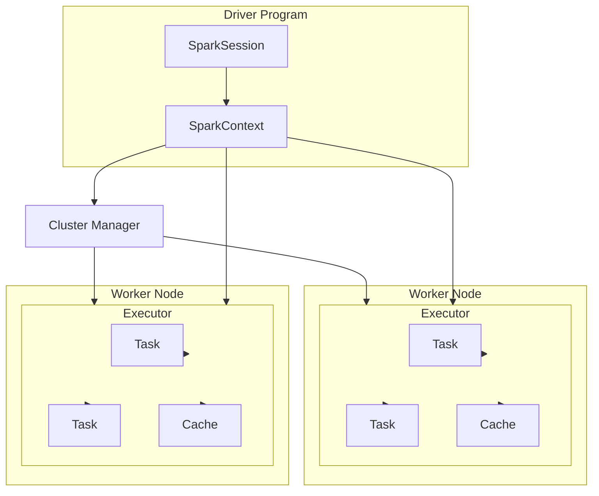
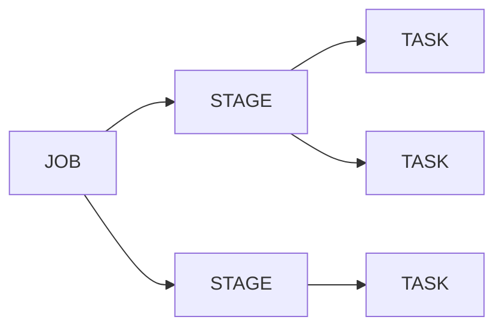
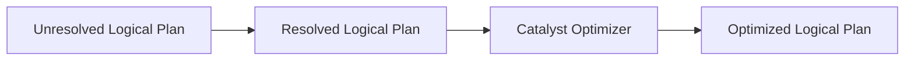
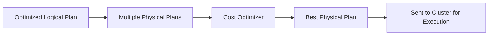
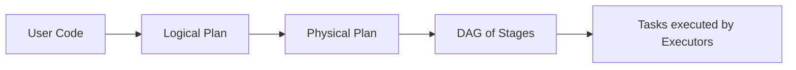

# Spark

## What is Spark?

**Spark** is an open source unified computing engine with a set of libraries for **parallel data processing** on a computer cluster.

It supports widely used programming languages such as:

- **Scala**
- **Python**
- **Java**
- **R**

It processes data in **memory (RAM)**, which makes it 100 times faster than traditional Hadoop MapReduce.



### Spark Components

Following represents Spark components at a high level:
- Low Level API – RDD & Distributed Variables
- Structured API – DataFrames, Datasets, and SQL
- Libraries and Ecosystem – Structured Streaming and Advanced Analytics

LAYER STRUCTURE
|:----------------------:|
| Libraries & Ecosystem  |
| Structured API         |
| Low Level API          |

## How Spark Works

### 1. Drivers and Executors
- **Driver**: The brain of a Spark application. It translates your code into a logical execution plan and coordinates work.  
- **Executors**: The workers. They run on cluster nodes, do the actual computation, and store data in memory/disk.  

Think of the **Driver as a manager** and **Executors as employees** doing the tasks.  

---

### 2. Jobs, Stages, and Tasks
- **Job**: Triggered when you call an action (like `.collect()` or `.save()`). A job = big unit of work.  
- **Stage**: Spark splits the job into smaller parts based on shuffle boundaries (data movement points).  
- **Task**: The smallest unit. Each stage is broken into many tasks, one per partition of data.  

👉 Flow: **Job → Stages → Tasks → Results**



## What is Partition?

To allow every executor to work in parallel, Spark breaks down the data into chunks called partitions.

## What is Transformation?
The **instruction** or **code** to modify and transform data is known as Transformation.

**Examples**: select,where,groupBy etc.

Transformation helps in building the **logical plan**.

Two Types:
- **Narrow Transformation**
- **Wide Transformation**

## What are Actions?
To **trigger the execution** we need to call an **Action**.

This basically executes the plan created by Transformation.

Actions are of three types:
- **View data** in console
- **Collect data** to native language
- **Write data** to output data sources

### Spark prefers Lazy Evaluation

**Transformations are lazy** → Spark doesn’t execute them immediately; it just builds a logical plan (DAG).
**Execution happens only on actions** → When an action (collect, count, save) is called, Spark optimizes the DAG and runs it.

### Shuffle in Spark
- **When**: Happens during **wide transformations** (`groupByKey`, `reduceByKey`, `join`, etc.).
- **What**: Data is **redistributed across the cluster** so records with the same key end up in the same partition.  
- **Impact**: A **new stage** is created in the DAG because shuffle requires data movement across executors.


> Shuffling occurs because wide transformations require **related data (e.g., same keys)** to be co-located in the **same partition**, which necessitates **repartitioning** and **redistributing** data across nodes.

> [!NOTE]
> In Spark, **actions (like count, collect, saveAsTextFile) create a job and trigger its execution, wide transformations (such as groupByKey, reduceByKey, join) introduce shuffle boundaries by redistributing data across partitions, and these boundaries split the job into stages, where tasks are scheduled and executed in parallel on cluster nodes.**


## What is Spark Session?

- The Driver Process is known as Spark Session.
- It is the entry point for a Spark execution.
- The Spark Session instance executes the code in the cluster.
- The relation is one-to-one, i.e., for one Spark Application, there will be one Spark Session instance.

### Structured API - DataFrames

- DataFrame is the most common Structured API, represented like a table.
- The table is represented in form of Rows and Columns.
- DataFrame has schema, which is the metadata for the columns.
- Data in DataFrames are in partitions.
- DataFrames are immutable.

> [!NOTE]
> DataFrames are **immutable**, meaning every transformation creates a **new DataFrame** without altering the original one.
### Structured API Execution Plan
### 1. **Logial Planning**
The Spark **Driver** first converts your code (Transformations/Actions) into a **logical plan**.
Represents **what** needs to be done without worrying about **how** it will be executed.

### 2. **Physical Planning**
Spark converts the **logical plan** into a **physical plan**, deciding **how** to execute it (which operations run where, partitioning, joins, etc.).
Optimizes for performance (e.g., choosing sort merge join vs broadcast join).



### 3. DAG (Directed Acyclic Graph)

Spark breaks the physical plan into a **DAG of stages**.
Shows **dependencies between stages** and ensures tasks are executed in the correct order.

**Flow**: DAG → Stages → Tasks → Execution

--- 

### Summary Flow



## Creating a Spark Session in PySpark

A **SparkSession** is the entry point to using PySpark. It allows interaction with Spark’s functionalities (DataFrame, SQL, etc.).

### Example
```python
from pyspark.sql import SparkSession

spark = (
    SparkSession
    .builder
    .appName("Spark Introduction")
    .master("local[*]")
    .getOrCreate()
)
```

- `SparkSession.builder`: used to configure the session.
- `.appName("...")`: sets the application name.
- `.master("local[*]")`: runs Spark locally using all CPU cores.
- `.getOrCreate()`: returns an existing session or creates a new one.

**Note**:In Databricks, you don’t need to create a SparkSession manually. A spark session is already available by default, so you can directly use spark.read, spark.sql, etc.

## Creating DataFrames in PySpark

### 1. From In-Memory Data
You can create a DataFrame directly from Python objects (lists, tuples, dicts).

```python
data = [("Alice", 25), ("Bob", 30), ("Charlie", 35)]
columns = ["Name", "Age"]

df = spark.createDataFrame(data, columns)
df.show()
```

### 2. From File

You can load data from CSV, JSON, Parquet, etc.

```python
df = spark.read.csv("path/to/file.csv", header=True, inferSchema=True)
df.show()
df = spark.read.json("path/to/file.json")
df.show()
```

