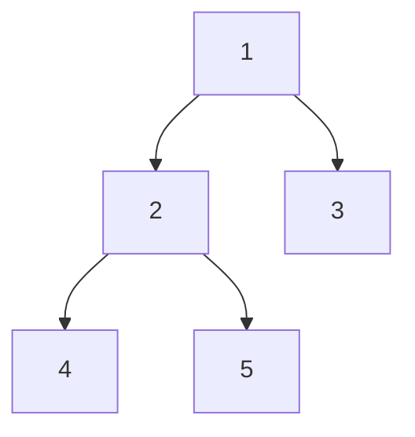

# SQL LeetCode

## 175. Combine Two Tables

#### Description

**Table: Person**

| Column Name | Type    |
|-------------|---------|
| PersonId    | int     |
| FirstName   | varchar |
| LastName    | varchar |

- **PersonId** is the primary key column for this table.

**Table: Address**

| Column Name | Type    |
|-------------|---------|
| AddressId   | int     |
| PersonId    | int     |
| City        | varchar |
| State       | varchar |

- **AddressId** is the primary key column for this table.

Write a SQL query for a report that provides the following information for each person in the Person table, regardless if there is an address for them:

- **FirstName**
- **LastName**
- **City**
- **State**

{}
```sql
SELECT FirstName, LastName, City, State
FROM Person AS p
LEFT JOIN Address AS a 
ON p.PersonId = a.PersonId;
```
{}


## 176. Second Highest Salary

#### Description

Write a SQL query to get the second highest salary from the **Employee** table.

**Table: Employee**

| Column Name | Type |
|-------------|------|
| Id          | int  |
| Salary      | int  |

For example, given the above Employee table:

| Id | Salary |
|----|--------|
| 1  | 100    |
| 2  | 200    |
| 3  | 300    |

The query should return **200** as the second highest salary.  
If there is no second highest salary, then the query should return **null**.

**Result Table:**

| SecondHighestSalary |
|---------------------|
| 200                 |

{}
```sql
SELECT IFNULL((
    SELECT DISTINCT Salary
    FROM Employee
    ORDER BY Salary DESC
    LIMIT 1 OFFSET 1
), NULL) AS SecondHighestSalary;
```
{}


## 177. Nth Highest Salary

#### Description

Write a SQL query to get the **nth highest salary** from the **Employee** table.

**Table: Employee**

| Column Name | Type |
|-------------|------|
| Id          | int  |
| Salary      | int  |

For example, given the above Employee table:

| Id | Salary |
|----|--------|
| 1  | 100    |
| 2  | 200    |
| 3  | 300    |

The nth highest salary where n = 2 is **200**.  
If there is no nth highest salary, then the query should return **null**.

**Result Table:**

| getNthHighestSalary(2) |
|------------------------|
| 200                    |

{}
```sql
CREATE FUNCTION getNthHighestSalary(N INT) RETURNS INT
BEGIN
    DECLARE M INT;
    SET M = N - 1;

    RETURN (
        SELECT DISTINCT Salary
        FROM Employee
        ORDER BY Salary DESC
        LIMIT 1 OFFSET M
    );
END
```
{}


## 178. Rank Scores

#### Description

Write a SQL query to rank scores. If there is a tie between two scores, both should have the **same ranking**.  
After a tie, the next ranking number should be the next consecutive integer value (no "holes" between ranks).

**Table: Scores**

| Column Name | Type  |
|-------------|-------|
| Id          | int   |
| Score       | float |

For example, given the above Scores table:

| Id | Score |
|----|-------|
| 1  | 3.50  |
| 2  | 3.65  |
| 3  | 4.00  |
| 4  | 3.85  |
| 5  | 4.00  |
| 6  | 3.65  |

The query should generate the following report (ordered by highest score):

| Score | Rank |
|-------|------|
| 4.00  | 1    |
| 4.00  | 1    |
| 3.85  | 2    |
| 3.65  | 3    |
| 3.65  | 3    |
| 3.50  | 4    |

{}
```sql
SELECT Score, DENSE_RANK() OVER(ORDER BY Score DESC) AS Rank
FROM Scores;
```
{}

{}
```sql
SELECT
    Score, @rank := @rank + (@prev <> (@prev := Score)) AS Rank
FROM
    Scores, (SELECT @rank := 0, @prev := -1) AS a
ORDER BY Score DESC;
```
{}

{}
```sql
SELECT
    Score,
    (SELECT COUNT(DISTINCT Score) FROM Scores WHERE Score >= s.Score) AS Rank
FROM Scores AS s
ORDER BY Score DESC;
```
{}


## 180. Consecutive Numbers

#### Description

Write a SQL query to find all numbers that appear **at least three times consecutively**.

**Table: Logs**

| Column Name | Type |
|-------------|------|
| Id          | int  |
| Num         | int  |

For example, given the above Logs table:

| Id | Num |
|----|-----|
| 1  | 1   |
| 2  | 1   |
| 3  | 1   |
| 4  | 2   |
| 5  | 1   |
| 6  | 2   |
| 7  | 2   |

The number `1` is the only number that appears consecutively at least three times.

**Result Table:**

| ConsecutiveNums |
|-----------------|
| 1               |

{}
```sql
SELECT DISTINCT Num AS ConsecutiveNums
FROM (
    SELECT
        Num,
        @cnt := IF(@prev = (@prev := Num), @cnt + 1, 1) AS freq
    FROM
        Logs, (SELECT @cnt := 0, @prev := (SELECT Num FROM Logs LIMIT 1)) AS c
) AS n
WHERE freq > 2;
```
{}


## 181. Employees Earning More Than Their Managers

#### Description

The **Employee** table holds all employees including their managers.  
Every employee has an `Id`, and there is also a column for the `ManagerId`.

**Table: Employee**

| Column Name | Type    |
|-------------|---------|
| Id          | int     |
| Name        | varchar |
| Salary      | int     |
| ManagerId   | int     |

Example data:

| Id | Name  | Salary | ManagerId |
|----|-------|--------|-----------|
| 1  | Joe   | 70000  | 3         |
| 2  | Henry | 80000  | 4         |
| 3  | Sam   | 60000  | NULL      |
| 4  | Max   | 90000  | NULL      |

Write a SQL query to find employees who earn **more than their managers**.  
For the above table, Joe is the only employee who earns more than his manager.

**Result Table:**

| Employee |
|----------|
| Joe      |

{}
```sql
SELECT e.Name AS Employee
FROM Employee AS e
INNER JOIN Employee AS m ON e.ManagerId = m.Id
WHERE e.Salary > m.Salary;
```
{}


## 182. Duplicate Emails

#### Description

Write a SQL query to find all **duplicate emails** in a table named **Person**.

**Table: Person**

| Column Name | Type    |
|-------------|---------|
| Id          | int     |
| Email       | varchar |

Example data:

| Id | Email   |
|----|---------|
| 1  | a@b.com |
| 2  | c@d.com |
| 3  | a@b.com |

The query should return:

| Email   |
|---------|
| a@b.com |

**Note:** All emails are in lowercase.

{}
```sql
SELECT Email
FROM Person
GROUP BY Email
HAVING COUNT(Email) > 1;
```
{}


## 183. Customers Who Never Order

#### Description

Suppose that a website contains two tables: **Customers** and **Orders**.  
Write a SQL query to find all customers who **never order anything**.

**Table: Customers**

| Column Name | Type    |
|-------------|---------|
| Id          | int     |
| Name        | varchar |

Example data:

| Id | Name  |
|----|-------|
| 1  | Joe   |
| 2  | Henry |
| 3  | Sam   |
| 4  | Max   |

**Table: Orders**

| Column Name | Type |
|-------------|------|
| Id          | int  |
| CustomerId  | int  |

Example data:

| Id | CustomerId |
|----|------------|
| 1  | 3          |
| 2  | 1          |

Using the above tables, the query should return:

| Customers |
|-----------|
| Henry     |
| Max       |

{}
```sql
SELECT Name AS Customers
FROM Customers
WHERE Id NOT IN (
    SELECT CustomerId
    FROM Orders
);
```
{}


## 196. Delete Duplicate Emails

#### Description

Write a SQL query to **delete all duplicate email entries** in a table named **Person**,  
keeping only unique emails based on the **smallest Id**.

**Table: Person**

| Column Name | Type    |
|-------------|---------|
| Id          | int     |
| Email       | varchar |

Example data:

| Id | Email            |
|----|-----------------|
| 1  | john@example.com |
| 2  | bob@example.com  |
| 3  | john@example.com |

After running the query, the table should look like:

| Id | Email            |
|----|-----------------|
| 1  | john@example.com |
| 2  | bob@example.com  |

**Note:** Your output is the whole Person table after executing your SQL. Use `DELETE` statement.

{}
```sql
DELETE p.*
FROM Person AS p
JOIN (
    SELECT Email, MIN(Id) AS minId
    FROM Person
    GROUP BY Email
    HAVING COUNT(*) > 1
) AS q
ON p.Email = q.Email
WHERE p.Id > q.minId;
```
{}

{}
```sql
DELETE p1
FROM Person AS p1
JOIN Person AS p2
ON p1.Email = p2.Email
WHERE p1.Id > p2.Id;
```
{}


## 197. Rising Temperature

#### Description

Given a **Weather** table, write a SQL query to find all dates' **Ids** with higher temperature compared to the previous (yesterday's) date.

**Table: Weather**

| Column Name   | Type |
|---------------|------|
| Id            | int  |
| RecordDate    | date |
| Temperature   | int  |

Example data:

| Id | RecordDate  | Temperature |
|----|------------|-------------|
| 1  | 2015-01-01 | 10          |
| 2  | 2015-01-02 | 25          |
| 3  | 2015-01-03 | 20          |
| 4  | 2015-01-04 | 30          |

The query should return the following Ids:

| Id |
|----|
| 2  |
| 4  |

{}
```sql
SELECT w1.Id
FROM Weather AS w1, Weather AS w2
WHERE DATEDIFF(w1.RecordDate, w2.RecordDate) = 1
  AND w1.Temperature > w2.Temperature;
```
{}


## 511. Game Play Analysis I

#### Description

**Table: Activity**

| Column Name  | Type |
|--------------|------|
| player_id    | int  |
| device_id    | int  |
| event_date   | date |
| games_played | int  |

- `(player_id, event_date)` is the primary key of this table.  
- This table shows the activity of players of a game.  
- Each row is a record of a player who logged in and played a number of games (possibly 0) before logging out on some day using some device.

Write an SQL query that reports the **first login date** for each player.

**Example: Activity table**

| player_id | device_id | event_date  | games_played |
|-----------|-----------|------------|--------------|
| 1         | 2         | 2016-03-01 | 5            |
| 1         | 2         | 2016-05-02 | 6            |
| 2         | 3         | 2017-06-25 | 1            |
| 3         | 1         | 2016-03-02 | 0            |
| 3         | 4         | 2018-07-03 | 5            |

**Result table**

| player_id | first_login |
|-----------|-------------|
| 1         | 2016-03-01  |
| 2         | 2017-06-25  |
| 3         | 2016-03-02  |

{}
```sql
SELECT player_id, MIN(event_date) AS first_login
FROM Activity
GROUP BY player_id
ORDER BY player_id;
```
{}

## 512. Game Play Analysis II

#### Description

**Table: Activity**

| Column Name  | Type |
|--------------|------|
| player_id    | int  |
| device_id    | int  |
| event_date   | date |
| games_played | int  |

- `(player_id, event_date)` is the primary key of this table.  
- This table shows the activity of players of a game.  
- Each row is a record of a player who logged in and played a number of games (possibly 0) before logging out on some day using some device.

Write an SQL query that reports the **device that is first logged in** for each player.

**Example: Activity table**

| player_id | device_id | event_date  | games_played |
|-----------|-----------|------------|--------------|
| 1         | 2         | 2016-03-01 | 5            |
| 1         | 2         | 2016-05-02 | 6            |
| 2         | 3         | 2017-06-25 | 1            |
| 3         | 1         | 2016-03-02 | 0            |
| 3         | 4         | 2018-07-03 | 5            |

**Result table**

| player_id | device_id |
|-----------|-----------|
| 1         | 2         |
| 2         | 3         |
| 3         | 1         |

{}
```sql
SELECT player_id, device_id
FROM Activity
WHERE (player_id, event_date) IN (
    SELECT player_id, MIN(event_date)
    FROM Activity
    GROUP BY player_id
);
```
{}


## 534. Game Play Analysis III

#### Description

**Table: Activity**

| Column Name  | Type |
|--------------|------|
| player_id    | int  |
| device_id    | int  |
| event_date   | date |
| games_played | int  |

- `(player_id, event_date)` is the primary key of this table.  
- This table shows the activity of players of a game.  
- Each row is a record of a player who logged in and played a number of games (possibly 0) before logging out on some day using some device.

Write an SQL query that reports for each player and date, **how many games played so far by the player**.  
That is, the total number of games played by the player **until that date**. Only consider the days the player logged in.

**Example: Activity table**

| player_id | device_id | event_date  | games_played |
|-----------|-----------|------------|--------------|
| 1         | 2         | 2016-03-01 | 5            |
| 1         | 2         | 2016-05-02 | 6            |
| 1         | 3         | 2017-06-25 | 1            |
| 3         | 1         | 2016-03-02 | 0            |
| 3         | 4         | 2018-07-03 | 5            |

**Result table**

| player_id | event_date  | games_played_so_far |
|-----------|------------|-------------------|
| 1         | 2016-03-01 | 5                 |
| 1         | 2016-05-02 | 11                |
| 1         | 2017-06-25 | 12                |
| 3         | 2016-03-02 | 0                 |
| 3         | 2018-07-03 | 5                 |

**Explanation:**  
- For player 1: 5 + 6 = 11 games by 2016-05-02, 5 + 6 + 1 = 12 games by 2017-06-25.  
- For player 3: 0 + 5 = 5 games by 2018-07-03.

{}
```sql
SELECT player_id, event_date, games_played_so_far
FROM (
    SELECT
        player_id,
        event_date,
        @games := IF(player_id = @player, @games + games_played, games_played) AS games_played_so_far,
        @player := player_id
    FROM
        (SELECT * FROM Activity ORDER BY player_id, event_date) AS a,
        (SELECT @player := -1, @games := 0) AS tmp
) AS t;
```
{}


## 570. Managers with at Least 5 Direct Reports

#### Description

The **Employee** table holds all employees including their managers.  
Every employee has an `Id`, and there is also a column for the `ManagerId`.

**Table: Employee**

| Id  | Name  | Department | ManagerId |
|-----|-------|-----------|-----------|
| 101 | John  | A         | null      |
| 102 | Dan   | A         | 101       |
| 103 | James | A         | 101       |
| 104 | Amy   | A         | 101       |
| 105 | Anne  | A         | 101       |
| 106 | Ron   | B         | 101       |

Write a SQL query to find **managers with at least 5 direct reports**.  
No one would report to himself.

**Result table**

| Name |
|------|
| John |

{}
```sql
SELECT Name
FROM Employee
WHERE Id IN (
    SELECT ManagerId
    FROM Employee
    GROUP BY ManagerId
    HAVING COUNT(*) >= 5
);
```
{}


## 577. Employee Bonus

#### Description

Select all employees' **name** and **bonus** whose bonus is **less than 1000**.

**Table: Employee**

| Column Name | Type    |
|-------------|---------|
| empId       | int     |
| name        | varchar |
| supervisor  | int     |
| salary      | int     |

Example data:

| empId | name   | supervisor | salary |
|-------|--------|-----------|--------|
| 1     | John   | 3         | 1000   |
| 2     | Dan    | 3         | 2000   |
| 3     | Brad   | null      | 4000   |
| 4     | Thomas | 3         | 4000   |

**Table: Bonus**

| Column Name | Type |
|-------------|------|
| empId       | int  |
| bonus       | int  |

Example data:

| empId | bonus |
|-------|-------|
| 2     | 500   |
| 4     | 2000  |

**Result table**

| name  | bonus |
|-------|-------|
| John  | null  |
| Dan   | 500   |
| Brad  | null  |

{}
```sql
SELECT name, bonus
FROM Employee AS e
LEFT JOIN Bonus AS b ON e.empId = b.empId
WHERE bonus < 1000 OR bonus IS NULL;
```
{}

## 584. Find Customer Referee

#### Description

Given a table **customer** holding customer information and the referee.

**Table: customer**

| Column Name  | Type    |
|--------------|---------|
| id           | int     |
| name         | varchar |
| referee_id   | int     |

Example data:

| id | name | referee_id |
|----|------|------------|
| 1  | Will | NULL       |
| 2  | Jane | NULL       |
| 3  | Alex | 2          |
| 4  | Bill | NULL       |
| 5  | Zack | 1          |
| 6  | Mark | 2          |

Write a query to return the list of **customers NOT referred by the person with id `2`**.

**Result table**

| name |
|------|
| Will |
| Jane |
| Bill |
| Zack |

{}
```sql
SELECT name
FROM customer
WHERE referee_id IS NULL OR referee_id <> 2;
```
{}


## 586. Customer Placing the Largest Number of Orders

#### Description

Query the `customer_number` from the **orders** table for the customer who has placed the **largest number of orders**.  
It is guaranteed that exactly one customer will have placed more orders than any other customer.

**Table: orders**

| Column           | Type      |
|------------------|-----------|
| order_number (PK)| int       |
| customer_number  | int       |
| order_date       | date      |
| required_date    | date      |
| shipped_date     | date      |
| status           | char(15)  |
| comment          | char(200) |

**Example data**

| order_number | customer_number | order_date  | required_date | shipped_date | status | comment |
|--------------|----------------|------------|---------------|--------------|--------|---------|
| 1            | 1              | 2017-04-09 | 2017-04-13    | 2017-04-12   | Closed |         |
| 2            | 2              | 2017-04-15 | 2017-04-20    | 2017-04-18   | Closed |         |
| 3            | 3              | 2017-04-16 | 2017-04-25    | 2017-04-20   | Closed |         |
| 4            | 3              | 2017-04-18 | 2017-04-28    | 2017-04-25   | Closed |         |

**Result table**

| customer_number |
|-----------------|
| 3               |

**Explanation:**  
Customer '3' has 2 orders, which is greater than customer '1' or '2', who each have only 1 order.

**Follow-up:**  
If more than one customer has the largest number of orders, the query can return all such `customer_number`.

{}
```sql
SELECT customer_number
FROM (
    SELECT customer_number, COUNT(*) AS cnt
    FROM orders
    GROUP BY customer_number
) AS e
ORDER BY e.cnt DESC
LIMIT 1;
```
{}

## 595. Big Countries

#### Description

There is a table **World**:

| Column Name | Type |
|-------------|------|
| name        | varchar |
| continent   | varchar |
| area        | int     |
| population  | int     |
| gdp         | int     |

A country is **big** if it has **an area bigger than 3 million sq km** or **a population of more than 25 million**.

Write a SQL query to output **big countries' name, population, and area**.

**Example data**

| name        | continent | area      | population | gdp       |
|-------------|-----------|-----------|------------|-----------|
| Afghanistan | Asia      | 652230    | 25500100   | 20343000  |
| Albania     | Europe    | 28748     | 2831741    | 12960000  |
| Algeria     | Africa    | 2381741   | 37100000   | 188681000 |
| Andorra     | Europe    | 468       | 78115      | 3712000   |
| Angola      | Africa    | 1246700   | 20609294   | 100990000 |

**Result table**

| name        | population | area      |
|-------------|------------|-----------|
| Afghanistan | 25500100   | 652230    |
| Algeria     | 37100000   | 2381741   |

{}
```sql
SELECT name, population, area
FROM World
WHERE area >= 3000000 OR population >= 25000000;
```
{}


## 596. Classes More Than 5 Students

#### Description

There is a table **courses** with columns `student` and `class`.  
List out all **classes** which have **5 or more students**.  
Duplicate students in a class should **not** be counted.

**Example data**

| student | class      |
|---------|------------|
| A       | Math       |
| B       | English    |
| C       | Math       |
| D       | Biology    |
| E       | Math       |
| F       | Computer   |
| G       | Math       |
| H       | Math       |
| I       | Math       |

**Result table**

| class |
|-------|
| Math  |

{}
```sql
SELECT class
FROM courses
GROUP BY class
HAVING COUNT(DISTINCT student) >= 5;
```
{}


## 597. Friend Requests I: Overall Acceptance Rate

#### Description

In a social network, people send friend requests and accept others’ requests.  
Given two tables:

**Table: friend_request**

| sender_id | send_to_id | request_date |
|-----------|------------|--------------|
| 1         | 2          | 2016-06-01   |
| 1         | 3          | 2016-06-01   |
| 1         | 4          | 2016-06-01   |
| 2         | 3          | 2016-06-02   |
| 3         | 4          | 2016-06-09   |

**Table: request_accepted**

| requester_id | accepter_id | accept_date |
|--------------|-------------|-------------|
| 1            | 2           | 2016-06-03  |
| 1            | 3           | 2016-06-08  |
| 2            | 3           | 2016-06-08  |
| 3            | 4           | 2016-06-09  |
| 3            | 4           | 2016-06-10  |

Write a query to find the **overall acceptance rate of requests** rounded to 2 decimals:  
`accept_rate = number of unique accepted requests ÷ number of unique requests`.

**Result table**

| accept_rate |
|-------------|
| 0.80        |

**Note:**
- Only **distinct** requests and acceptances are counted.  
- If there are no requests, return `0.00`.  
- Accepted requests may not appear in the `friend_request` table.

{}
```sql
SELECT ROUND(IF(requests = 0, 0, accepts / requests), 2) AS accept_rate
FROM
(
    SELECT COUNT(DISTINCT sender_id, send_to_id) AS requests
    FROM friend_request
) AS r,
(
    SELECT COUNT(DISTINCT requester_id, accepter_id) AS accepts
    FROM request_accepted
) AS a;
```
{}


## 603. Consecutive Available Seats

#### Description

Several friends at a cinema want to reserve **consecutive available seats**.  
Given a table **cinema**:

| seat_id | free |
|---------|------|
| 1       | 1    |
| 2       | 0    |
| 3       | 1    |
| 4       | 1    |
| 5       | 1    |

- `seat_id` is an auto-increment integer.  
- `free` is a boolean (`1` = free, `0` = occupied).  
- Consecutive available seats are **2 or more consecutive free seats**.

Return all consecutive available seats **ordered by `seat_id`**.

**Result table**

| seat_id |
|---------|
| 3       |
| 4       |
| 5       |

{}
```sql
SELECT DISTINCT c1.seat_id
FROM cinema AS c1
JOIN cinema AS c2
JOIN cinema AS c3
  ON c1.seat_id = c2.seat_id + 1 OR c1.seat_id = c3.seat_id - 1
WHERE c1.free = 1 AND c2.free = 1 AND c3.free = 1;

-- Alternative solution
SELECT DISTINCT c2.seat_id
FROM cinema AS c1, cinema AS c2
WHERE c1.free = 1 AND c2.free = 1 AND c1.seat_id = c2.seat_id + 1

UNION

SELECT DISTINCT c1.seat_id
FROM cinema AS c1, cinema AS c2
WHERE c1.free = 1 AND c2.free = 1 AND c1.seat_id = c2.seat_id + 1
ORDER BY seat_id;
```
{}

## 607. Sales Person

#### Description

Given three tables: **salesperson**, **company**, and **orders**,  
output all salesperson names who **did not have sales** to company `'RED'`.

**Table: salesperson**

| sales_id | name | salary  | commission_rate | hire_date  |
|----------|------|---------|----------------|------------|
| 1        | John | 100000  | 6              | 4/1/2006   |
| 2        | Amy  | 120000  | 5              | 5/1/2010   |
| 3        | Mark | 65000   | 12             | 12/25/2008 |
| 4        | Pam  | 25000   | 25             | 1/1/2005   |
| 5        | Alex | 50000   | 10             | 2/3/2007   |

**Table: company**

| com_id | name   | city       |
|--------|--------|------------|
| 1      | RED    | Boston     |
| 2      | ORANGE | New York   |
| 3      | YELLOW | Boston     |
| 4      | GREEN  | Austin     |

**Table: orders**

| order_id | order_date | com_id | sales_id | amount |
|----------|------------|--------|----------|--------|
| 1        | 1/1/2014   | 3      | 4        | 100000 |
| 2        | 2/1/2014   | 4      | 5        | 5000   |
| 3        | 3/1/2014   | 1      | 1        | 50000  |
| 4        | 4/1/2014   | 1      | 4        | 25000  |

**Result table**

| name  |
|-------|
| Amy   |
| Mark  |
| Alex  |

**Explanation:**  
Only 'John' and 'Pam' have sales to `'RED'`. Output all other salesperson names.

{}
```sql
SELECT s.name
FROM salesperson AS s
WHERE s.sales_id NOT IN (
    SELECT o.sales_id
    FROM orders AS o
    LEFT JOIN company AS c ON o.com_id = c.com_id
    WHERE c.name = 'RED'
);
```
{}


## 608. Tree Node

#### Description

Given a table **tree** where `id` is the identifier of a tree node and `p_id` is its parent node's id:

| id | p_id |
|----|------|
| 1  | null |
| 2  | 1    |
| 3  | 1    |
| 4  | 2    |
| 5  | 2    |

Each node can be one of three types:

- **Leaf**: Node with no children.
- **Root**: Node with no parent.
- **Inner**: Node with parent and at least one child.

Write a query to print the node `id` and its `Type`. Sort output by `id`.

**Result table**

| id | Type  |
|----|-------|
| 1  | Root  |
| 2  | Inner |
| 3  | Leaf  |
| 4  | Leaf  |
| 5  | Leaf  |

**Explanation:**  
- Node `1` is **Root** because its parent is `NULL`.  
- Node `2` is **Inner** because it has a parent and children.  
- Nodes `3`, `4`, and `5` are **Leaf** because they have a parent and no children.

Tree visualization:


{}
```sql
SELECT
    id,
    CASE
        WHEN p_id IS NULL THEN 'Root'
        WHEN p_id IS NOT NULL AND id IN (SELECT DISTINCT p_id FROM tree) THEN 'Inner'
        ELSE 'Leaf'
    END AS Type
FROM tree;
```
{}


## 610. Triangle Judgement

#### Description

Given a table **triangle** with columns `x`, `y`, and `z` representing the lengths of three sides,  
write a query to determine whether the sides can form a triangle.

| x  | y  | z  |
|----|----|----|
| 13 | 15 | 30 |
| 10 | 20 | 15 |

**Result table**

| x  | y  | z  | triangle |
|----|----|----|----------|
| 13 | 15 | 30 | No       |
| 10 | 20 | 15 | Yes      |

**Explanation:**  
A triangle is valid if the sum of any two sides is greater than the third side.

{}
```sql
SELECT x, y, z,
    CASE
        WHEN x + y > z AND x + z > y AND y + z > x THEN 'Yes'
        ELSE 'No'
    END AS triangle
FROM triangle;
```
{}


## 612. Shortest Distance in a Plane

#### Description

Given a table **point_2d** with coordinates `(x, y)` of unique points in a plane,  
write a query to find the shortest distance between any two points, rounded to 2 decimals.

| x  | y  |
|----|----|
| -1 | -1 |
| 0  | 0  |
| -1 | -2 |

**Result table**

| shortest |
|----------|
| 1.00     |

**Explanation:**  
The shortest distance is `1.00`, between points `(-1,-1)` and `(-1,-2)`.

{}
```sql
SELECT ROUND(MIN(dist), 2) AS shortest
FROM (
    SELECT IF(a.x = b.x AND a.y = b.y, 10000,
              SQRT(POWER(a.x - b.x, 2) + POWER(a.y - b.y, 2))) AS dist
    FROM point_2d AS a, point_2d AS b
) AS d;
```
{}


## 613. Shortest Distance in a Line

#### Description

Given a table **point** with the x-coordinates of unique points on the x-axis,  
write a query to find the shortest distance between any two points.

| x   |
|-----|
| -1  |
| 0   |
| 2   |

**Result table**

| shortest |
|----------|
| 1        |

**Explanation:**  
The shortest distance is `1`, between points `-1` and `0`.

{}
```sql
SELECT MIN(ABS(a.x - b.x)) AS shortest
FROM point AS a, point AS b
WHERE a.x != b.x;
```
{}

## 619. Biggest Single Number

#### Description

Given a table **my_numbers** containing numbers in column `num` (may include duplicates),  
write a query to find the largest number that appears only once.

| num |
|-----|
| 8   |
| 8   |
| 3   |
| 3   |
| 1   |
| 4   |
| 5   |
| 6   |

**Result table**

| num |
|-----|
| 6   |

**Explanation:**  
The number `6` is the largest number that appears exactly once.

{}
```sql
SELECT MAX(num) AS num
FROM (
    SELECT num
    FROM my_numbers
    GROUP BY num
    HAVING COUNT(num) = 1
) AS n;
```
{}

## 620. Not Boring Movies

#### Description

Given a table **cinema** with columns `id`, `movie`, `description`, and `rating`,  
write a query to output movies with **odd-numbered IDs** and a description that is **not 'boring'**, ordered by `rating` descending.

**Table: cinema**

| id  | movie      | description   | rating |
|-----|-----------|---------------|--------|
| 1   | War       | great 3D      | 8.9    |
| 2   | Science   | fiction       | 8.5    |
| 3   | irish     | boring        | 6.2    |
| 4   | Ice song  | Fantacy       | 8.6    |
| 5   | House card| Interesting   | 9.1    |

**Expected output**

| id  | movie       | description   | rating |
|-----|------------|---------------|--------|
| 5   | House card | Interesting   | 9.1    |
| 1   | War        | great 3D      | 8.9    |

{}
```sql
SELECT id, movie, description, rating
FROM cinema
WHERE id % 2 = 1 AND description <> 'boring'
ORDER BY rating DESC;
```
{}


## 626. Exchange Seats

#### Description

Given a table **seat** with columns `id` and `student`, Mary wants to swap seats for adjacent students.  
If the number of students is odd, the last student keeps their seat.

**Table: seat**

| id  | student |
|-----|---------|
| 1   | Abbot   |
| 2   | Doris   |
| 3   | Emerson |
| 4   | Green   |
| 5   | Jeames  |

**Expected output**

| id  | student |
|-----|---------|
| 1   | Doris   |
| 2   | Abbot   |
| 3   | Green   |
| 4   | Emerson |
| 5   | Jeames  |

{}
```sql
SELECT 
    IF(MOD(id, 2) = 0, id - 1, IF(id < (SELECT MAX(id) FROM seat), id + 1, id)) AS id,
    student
FROM seat
ORDER BY id;
```
{}


## 627. Swap Salary

#### Description

Given a table **salary** with a `sex` column containing `'m'` or `'f'`, swap all values: `'m'` → `'f'` and `'f'` → `'m'` using a single update statement.

**Table: salary**

| id | name | sex | salary |
|----|------|-----|--------|
| 1  | A    | m   | 2500   |
| 2  | B    | f   | 1500   |
| 3  | C    | m   | 5500   |
| 4  | D    | f   | 500    |

**Expected output after update**

| id | name | sex | salary |
|----|------|-----|--------|
| 1  | A    | f   | 2500   |
| 2  | B    | m   | 1500   |
| 3  | C    | f   | 5500   |
| 4  | D    | m   | 500    |

{}
```sql
UPDATE salary
SET sex = IF(sex = 'm', 'f', 'm');
```
{}


## 1045. Customers Who Bought All Products  

#### Description  
Given two tables **Customer** and **Product**, write an SQL query to find customers who bought **all** the products available in the Product table.  

**Table: Customer**  

| customer_id | product_key |  
|-------------|-------------|  
| 1           | 5           |  
| 2           | 6           |  
| 3           | 5           |  
| 3           | 6           |  
| 1           | 6           |  

**Table: Product**  

| product_key |  
|-------------|  
| 5           |  
| 6           |  

**Expected Output**  

| customer_id |  
|-------------|  
| 1           |  
| 3           |  

The customers who bought all the products (5 and 6) are customers with id `1` and `3`.  

{}  
```sql
SELECT customer_id
FROM Customer
GROUP BY customer_id
HAVING SUM(DISTINCT product_key) = (
    SELECT SUM(product_key) FROM Product
);
```
{}


## 1050. Actors and Directors Who Cooperated At Least Three Times  

#### Description  
Given a table **ActorDirector**, write an SQL query to find the pairs `(actor_id, director_id)` where the actor has cooperated with the director at least **3 times**.  

**Table: ActorDirector**  

| actor_id | director_id | timestamp |  
|----------|-------------|-----------|  
| 1        | 1           | 0         |  
| 1        | 1           | 1         |  
| 1        | 1           | 2         |  
| 1        | 2           | 3         |  
| 1        | 2           | 4         |  
| 2        | 1           | 5         |  
| 2        | 1           | 6         |  

**Expected Output**  

| actor_id | director_id |  
|----------|-------------|  
| 1        | 1           |  

The only pair is `(1, 1)` where they cooperated exactly 3 times.  

{}  
```sql
SELECT actor_id, director_id
FROM ActorDirector
GROUP BY actor_id, director_id
HAVING COUNT(*) >= 3;
```
{}

## 1068. Product Sales Analysis I  

#### Description  
Given two tables **Sales** and **Product**, write an SQL query to report all product names of the products in the Sales table along with their selling year and price.  

**Table: Sales**  

| sale_id | product_id | year | quantity | price |  
|---------|------------|------|----------|-------|  
| 1       | 100        | 2008 | 10       | 5000  |  
| 2       | 100        | 2009 | 12       | 5000  |  
| 7       | 200        | 2011 | 15       | 9000  |  

**Table: Product**  

| product_id | product_name |  
|------------|--------------|  
| 100        | Nokia        |  
| 200        | Apple        |  
| 300        | Samsung      |  

**Expected Output**  

| product_name | year | price |  
|--------------|------|-------|  
| Nokia        | 2008 | 5000  |  
| Nokia        | 2009 | 5000  |  
| Apple        | 2011 | 9000  |  

{}  
```sql
SELECT DISTINCT
    P.product_name, S.year, S.price
FROM
    (SELECT DISTINCT product_id, year, price FROM Sales) S
INNER JOIN
    Product AS P
USING (product_id);
```
{}


## 1069. Product Sales Analysis II  

#### Description  
Given two tables **Sales** and **Product**, write an SQL query to report the **total quantity sold** for every product id.  

**Table: Sales**  

| sale_id | product_id | year | quantity | price |  
|---------|------------|------|----------|-------|  
| 1       | 100        | 2008 | 10       | 5000  |  
| 2       | 100        | 2009 | 12       | 5000  |  
| 7       | 200        | 2011 | 15       | 9000  |  

**Table: Product**  

| product_id | product_name |  
|------------|--------------|  
| 100        | Nokia        |  
| 200        | Apple        |  
| 300        | Samsung      |  

**Expected Output**  

| product_id | total_quantity |  
|------------|----------------|  
| 100        | 22             |  
| 200        | 15             |  

{}  
```sql
SELECT product_id, SUM(quantity) AS total_quantity
FROM Sales
GROUP BY product_id;
```
{}

## 1070. Product Sales Analysis III  

#### Description  
Given two tables **Sales** and **Product**, write an SQL query to select the **product id, year, quantity, and price for the first year** of every product sold.  

**Table: Sales**  

| sale_id | product_id | year | quantity | price |  
|---------|------------|------|----------|-------|  
| 1       | 100        | 2008 | 10       | 5000  |  
| 2       | 100        | 2009 | 12       | 5000  |  
| 7       | 200        | 2011 | 15       | 9000  |  

**Table: Product**  

| product_id | product_name |  
|------------|--------------|  
| 100        | Nokia        |  
| 200        | Apple        |  
| 300        | Samsung      |  

**Expected Output**  

| product_id | first_year | quantity | price |  
|------------|------------|----------|-------|  
| 100        | 2008       | 10       | 5000  |  
| 200        | 2011       | 15       | 9000  |  

{}  
```sql
SELECT product_id, year AS first_year, quantity, price
FROM Sales
WHERE (product_id, year) IN (
    SELECT product_id, MIN(year) AS year
    FROM Sales
    GROUP BY product_id
);
```
{}


## 1075. Project Employees I  

#### Description  
Given two tables **Project** and **Employee**, write an SQL query to report the **average experience years** of all the employees for each project, rounded to 2 digits.  

**Table: Project**  

| project_id | employee_id |  
|------------|-------------|  
| 1          | 1           |  
| 1          | 2           |  
| 1          | 3           |  
| 2          | 1           |  
| 2          | 4           |  

**Table: Employee**  

| employee_id | name   | experience_years |  
|-------------|--------|------------------|  
| 1           | Khaled | 3                |  
| 2           | Ali    | 2                |  
| 3           | John   | 1                |  
| 4           | Doe    | 2                |  

**Expected Output**  

| project_id | average_years |  
|------------|---------------|  
| 1          | 2.00          |  
| 2          | 2.50          |  

The average experience years for the first project is `(3 + 2 + 1) / 3 = 2.00` and for the second project is `(3 + 2) / 2 = 2.50`.  

{}  
```sql
SELECT project_id, ROUND(AVG(experience_years), 2) AS average_years
FROM Project AS p
LEFT JOIN Employee AS e
    ON p.employee_id = e.employee_id
GROUP BY project_id;
```
{}

## 1076. Project Employees II  

#### Description  
Given two tables **Project** and **Employee**, write an SQL query to report all the projects that have the **most employees**.  

**Table: Project**  

| project_id | employee_id |  
|------------|-------------|  
| 1          | 1           |  
| 1          | 2           |  
| 1          | 3           |  
| 2          | 1           |  
| 2          | 4           |  

**Table: Employee**  

| employee_id | name   | experience_years |  
|-------------|--------|-----------------|  
| 1           | Khaled | 3               |  
| 2           | Ali    | 2               |  
| 3           | John   | 1               |  
| 4           | Doe    | 2               |  

**Expected Output**  

| project_id |  
|------------|  
| 1          |  

The first project has 3 employees while the second one has 2.  

{}  
```sql
SELECT project_id
FROM Project
GROUP BY project_id
HAVING COUNT(employee_id) >= (
    SELECT COUNT(employee_id) AS cnt
    FROM Project
    GROUP BY project_id
    ORDER BY cnt DESC
    LIMIT 1
);
```
{}

## 1077. Project Employees III  

#### Description  
Given two tables **Project** and **Employee**, write an SQL query to report the **most experienced employees in each project**. In case of a tie, report all employees with the maximum number of experience years.  

**Table: Project**  

| project_id | employee_id |  
|------------|-------------|  
| 1          | 1           |  
| 1          | 2           |  
| 1          | 3           |  
| 2          | 1           |  
| 2          | 4           |  

**Table: Employee**  

| employee_id | name   | experience_years |  
|-------------|--------|-----------------|  
| 1           | Khaled | 3               |  
| 2           | Ali    | 2               |  
| 3           | John   | 3               |  
| 4           | Doe    | 2               |  

**Expected Output**  

| project_id | employee_id |  
|------------|-------------|  
| 1          | 1           |  
| 1          | 3           |  
| 2          | 1           |  

Both employees with id 1 and 3 have the most experience among the employees of the first project. For the second project, the employee with id 1 has the most experience.  

{}  
```sql
SELECT p.project_id, e.employee_id
FROM Project AS p
JOIN Employee AS e
    ON p.employee_id = e.employee_id
WHERE (p.project_id, e.experience_years) IN (
    SELECT p.project_id, MAX(e.experience_years) AS experience_years
    FROM Project AS p
    JOIN Employee AS e
        ON p.employee_id = e.employee_id
    GROUP BY p.project_id
);
```
{}

## 1082. Sales Analysis I  

#### Description  
Given two tables **Product** and **Sales**, write an SQL query to report the **best seller by total sales price**. If there is a tie, report all of them.  

**Table: Product**  

| product_id | product_name | unit_price |  
|------------|--------------|------------|  
| 1          | S8           | 1000       |  
| 2          | G4           | 800        |  
| 3          | iPhone       | 1400       |  

**Table: Sales**  

| seller_id | product_id | buyer_id | sale_date  | quantity | price |  
|-----------|------------|----------|------------|----------|-------|  
| 1         | 1          | 1        | 2019-01-21 | 2        | 2000  |  
| 1         | 2          | 2        | 2019-02-17 | 1        | 800   |  
| 2         | 2          | 3        | 2019-06-02 | 1        | 800   |  
| 3         | 3          | 4        | 2019-05-13 | 2        | 2800  |  

**Expected Output**  

| seller_id |  
|-----------|  
| 1         |  
| 3         |  

Both sellers with id 1 and 3 sold products with the **most total price** of 2800.  

{}  
```sql
SELECT seller_id
FROM Sales
GROUP BY seller_id
HAVING SUM(price) >= (
    SELECT SUM(price) AS total_price
    FROM Sales
    GROUP BY seller_id
    ORDER BY total_price DESC
    LIMIT 1
);
```
{}

## 1083. Sales Analysis II  

#### Description  
Given two tables **Product** and **Sales**, write an SQL query to report the **buyers who have bought S8 but not iPhone**.  

**Table: Product**  

| product_id | product_name | unit_price |  
|------------|--------------|------------|  
| 1          | S8           | 1000       |  
| 2          | G4           | 800        |  
| 3          | iPhone       | 1400       |  

**Table: Sales**  

| seller_id | product_id | buyer_id | sale_date  | quantity | price |  
|-----------|------------|----------|------------|----------|-------|  
| 1         | 1          | 1        | 2019-01-21 | 2        | 2000  |  
| 1         | 2          | 2        | 2019-02-17 | 1        | 800   |  
| 2         | 1          | 3        | 2019-06-02 | 1        | 800   |  
| 3         | 3          | 3        | 2019-05-13 | 2        | 2800  |  

**Expected Output**  

| buyer_id |  
|----------|  
| 1        |  

The buyer with id 1 bought an S8 but didn't buy an iPhone. The buyer with id 3 bought both.  

{}  
```sql
SELECT DISTINCT s.buyer_id
FROM Sales AS s
JOIN Product AS p
    ON s.product_id = p.product_id
WHERE product_name = 'S8'
  AND s.buyer_id NOT IN (
      SELECT buyer_id
      FROM Sales AS s
      JOIN Product AS p
          ON s.product_id = p.product_id
      WHERE product_name = 'iPhone'
  );
```
{}


## 1084. Sales Analysis III  

#### Description  
Given two tables **Product** and **Sales**, write an SQL query to report the products that were **only sold in spring 2019** (between 2019-01-01 and 2019-03-31 inclusive).  

**Table: Product**  

| product_id | product_name | unit_price |  
|------------|--------------|------------|  
| 1          | S8           | 1000       |  
| 2          | G4           | 800        |  
| 3          | iPhone       | 1400       |  

**Table: Sales**  

| seller_id | product_id | buyer_id | sale_date  | quantity | price |  
|-----------|------------|----------|------------|----------|-------|  
| 1         | 1          | 1        | 2019-01-21 | 2        | 2000  |  
| 1         | 2          | 2        | 2019-02-17 | 1        | 800   |  
| 2         | 2          | 3        | 2019-06-02 | 1        | 800   |  
| 3         | 3          | 4        | 2019-05-13 | 2        | 2800  |  

**Expected Output**  

| product_id | product_name |  
|------------|--------------|  
| 1          | S8           |  

The product with id 1 was **only sold in spring 2019**, while the other products were sold after.  

{}  
```sql
SELECT product_id, product_name
FROM Sales
INNER JOIN Product USING(product_id)
GROUP BY product_id
HAVING SUM(IF(sale_date BETWEEN '2019-01-01' AND '2019-03-31', 1, 0)) =
       SUM(IF(sale_date IS NOT NULL, 1, 0));
```
{}


## 1112. Highest Grade For Each Student  

#### Description  
Given a table **Enrollments**, write an SQL query to find the **highest grade with its corresponding course** for each student. In case of a tie, select the course with the **smallest course_id**. The output must be sorted by **increasing student_id**.  

**Table: Enrollments**  

| student_id | course_id | grade |  
|------------|-----------|-------|  
| 2          | 2         | 95    |  
| 2          | 3         | 95    |  
| 1          | 1         | 90    |  
| 1          | 2         | 99    |  
| 3          | 1         | 80    |  
| 3          | 2         | 75    |  
| 3          | 3         | 82    |  

**Expected Output**  

| student_id | course_id | grade |  
|------------|-----------|-------|  
| 1          | 2         | 99    |  
| 2          | 2         | 95    |  
| 3          | 3         | 82    |  

{}  
```sql
SELECT student_id, MIN(course_id) AS course_id, grade
FROM Enrollments
WHERE (student_id, grade) IN (
    SELECT student_id, MAX(grade)
    FROM Enrollments
    GROUP BY student_id
)
GROUP BY student_id
ORDER BY student_id ASC;
```
{}


## 1113. Reported Posts  

#### Description  
Given a table **Actions**, write an SQL query that reports the **number of posts reported yesterday for each report reason**. Assume today is 2019-07-05.  

**Table: Actions**  

| user_id | post_id | action_date | action  | extra  |  
|---------|---------|-------------|---------|--------|  
| 1       | 1       | 2019-07-01  | view    | null   |  
| 1       | 1       | 2019-07-01  | like    | null   |  
| 1       | 1       | 2019-07-01  | share   | null   |  
| 2       | 4       | 2019-07-04  | view    | null   |  
| 2       | 4       | 2019-07-04  | report  | spam   |  
| 3       | 4       | 2019-07-04  | view    | null   |  
| 3       | 4       | 2019-07-04  | report  | spam   |  
| 4       | 3       | 2019-07-02  | view    | null   |  
| 4       | 3       | 2019-07-02  | report  | spam   |  
| 5       | 2       | 2019-07-04  | view    | null   |  
| 5       | 2       | 2019-07-04  | report  | racism |  
| 5       | 5       | 2019-07-04  | view    | null   |  
| 5       | 5       | 2019-07-04  | report  | racism |  

**Expected Output**  

| report_reason | report_count |  
|---------------|--------------|  
| spam          | 1            |  
| racism        | 2            |  

We only count reports **from yesterday** (2019-07-04).  

{}  
```sql
SELECT extra AS report_reason, COUNT(DISTINCT post_id) AS report_count
FROM Actions
WHERE action_date = '2019-07-04' AND action = 'report'
GROUP BY extra;
```
{}


## 1126. Active Businesses  

#### Description  
Given a table **Events**, write an SQL query to find all **active businesses**.  

An active business is a business that has **more than one event type** with **occurences greater than the average occurences of that event type among all businesses**.  

**Table: Events**  

| business_id | event_type | occurences |  
|-------------|------------|------------|  
| 1           | reviews    | 7          |  
| 3           | reviews    | 3          |  
| 1           | ads        | 11         |  
| 2           | ads        | 7          |  
| 3           | ads        | 6          |  
| 1           | page views | 3          |  
| 2           | page views | 12         |  

**Expected Output**  

| business_id |  
|-------------|  
| 1           |  

Average for 'reviews', 'ads' and 'page views' are (7+3)/2=5, (11+7+6)/3=8, (3+12)/2=7.5 respectively.  
Business with id 1 has 7 'reviews' events (>5) and 11 'ads' events (>8), so it is an active business.  

{}  
```sql
SELECT business_id
FROM Events e
JOIN (
    SELECT event_type, AVG(occurences) AS avg_occurences
    FROM Events
    GROUP BY event_type
) AS a
    ON e.event_type = a.event_type
WHERE e.occurences > a.avg_occurences
GROUP BY e.business_id
HAVING COUNT(*) > 1;
```
{}

## 1141. User Activity for the Past 30 Days I  

#### Description  
Given a table **Activity**, write an SQL query to find the **daily active user count** for a period of 30 days ending **2019-07-27** inclusively.  
A user is considered active on a day if they performed **at least one activity** on that day.  

**Table: Activity**  

| user_id | session_id | activity_date | activity_type |  
|---------|------------|---------------|---------------|  
| 1       | 1          | 2019-07-20    | open_session  |  
| 1       | 1          | 2019-07-20    | scroll_down   |  
| 1       | 1          | 2019-07-20    | end_session   |  
| 2       | 4          | 2019-07-20    | open_session  |  
| 2       | 4          | 2019-07-21    | send_message  |  
| 2       | 4          | 2019-07-21    | end_session   |  
| 3       | 2          | 2019-07-21    | open_session  |  
| 3       | 2          | 2019-07-21    | send_message  |  
| 3       | 2          | 2019-07-21    | end_session   |  
| 4       | 3          | 2019-06-25    | open_session  |  
| 4       | 3          | 2019-06-25    | end_session   |  

**Expected Output**  

| day        | active_users |  
|------------|--------------|  
| 2019-07-20 | 2            |  
| 2019-07-21 | 2            |  

Days with zero active users are not included.  

{}  
```sql
SELECT activity_date AS day, COUNT(DISTINCT user_id) AS active_users
FROM Activity
WHERE activity_date BETWEEN '2019-06-28' AND '2019-07-27'
GROUP BY day;
```
{}


## 1142. User Activity for the Past 30 Days II  

#### Description  
Given a table **Activity**, write an SQL query to find the **average number of sessions per user** for a period of 30 days ending **2019-07-27** inclusively, rounded to 2 decimal places.  
Only count sessions with **at least one activity** in that time period.  

**Table: Activity**  

| user_id | session_id | activity_date | activity_type |  
|---------|------------|---------------|---------------|  
| 1       | 1          | 2019-07-20    | open_session  |  
| 1       | 1          | 2019-07-20    | scroll_down   |  
| 1       | 1          | 2019-07-20    | end_session   |  
| 2       | 4          | 2019-07-20    | open_session  |  
| 2       | 4          | 2019-07-21    | send_message  |  
| 2       | 4          | 2019-07-21    | end_session   |  
| 3       | 2          | 2019-07-21    | open_session  |  
| 3       | 2          | 2019-07-21    | send_message  |  
| 3       | 2          | 2019-07-21    | end_session   |  
| 3       | 5          | 2019-07-21    | open_session  |  
| 3       | 5          | 2019-07-21    | scroll_down   |  
| 3       | 5          | 2019-07-21    | end_session   |  
| 4       | 3          | 2019-06-25    | open_session  |  
| 4       | 3          | 2019-06-25    | end_session   |  

**Expected Output**  

| average_sessions_per_user |  
|---------------------------|  
| 1.33                      |  

Explanation: Users 1 and 2 each had 1 session, user 3 had 2 sessions. Average = (1+1+2)/3 = 1.33.  

{}  
```sql
SELECT ROUND(IFNULL(SUM(sessions) / COUNT(user_id), 0), 2) AS average_sessions_per_user
FROM (
    SELECT user_id, COUNT(DISTINCT session_id) AS sessions
    FROM Activity
    WHERE activity_date BETWEEN '2019-06-28' AND '2019-07-27'
    GROUP BY user_id
    HAVING COUNT(*) >= 1
) AS u;
```
{}


## 1148. Article Views I  

#### Description  
Given a table **Views**, write an SQL query to find all **authors who viewed at least one of their own articles**, sorted in ascending order by their id.  

**Table: Views**  

| article_id | author_id | viewer_id | view_date  |  
|------------|-----------|-----------|------------|  
| 1          | 3         | 5         | 2019-08-01 |  
| 1          | 3         | 6         | 2019-08-02 |  
| 2          | 7         | 7         | 2019-08-01 |  
| 2          | 7         | 6         | 2019-08-02 |  
| 4          | 7         | 1         | 2019-07-22 |  
| 3          | 4         | 4         | 2019-07-21 |  
| 3          | 4         | 4         | 2019-07-21 |  

**Expected Output**  

| id |  
|----|  
| 4  |  
| 7  |  

{}  
```sql
SELECT DISTINCT author_id AS id
FROM Views
WHERE author_id = viewer_id
ORDER BY author_id;
```
{}


## 1164. Product Price at a Given Date  

#### Description  
Given a table **Products**, write an SQL query to find the **prices of all products on 2019-08-16**. Assume the price of all products before any change is 10.  

**Table: Products**  

| product_id | new_price | change_date |  
|------------|-----------|-------------|  
| 1          | 20        | 2019-08-14  |  
| 2          | 50        | 2019-08-14  |  
| 1          | 30        | 2019-08-15  |  
| 1          | 35        | 2019-08-16  |  
| 2          | 65        | 2019-08-17  |  
| 3          | 20        | 2019-08-18  |  

**Expected Output**  

| product_id | price |  
|------------|-------|  
| 2          | 50    |  
| 1          | 35    |  
| 3          | 10    |  

{}  
```sql
SELECT
    i.product_id,
    MAX(
        IF(
            i.product_id NOT IN (
                SELECT product_id 
                FROM Products 
                WHERE change_date <= DATE '2019-08-16' 
                GROUP BY product_id
            ), 
            10, 
            (
                SELECT new_price 
                FROM Products 
                WHERE product_id = i.product_id 
                AND change_date = q.max_change_date
            )
        )
    ) AS price
FROM
    (SELECT DISTINCT product_id FROM Products) AS i,
    (
        SELECT product_id, MAX(change_date) AS max_change_date
        FROM Products
        WHERE change_date <= DATE '2019-08-16'
        GROUP BY product_id
    ) AS q
GROUP BY i.product_id;
```
{}


## 1173. Immediate Food Delivery I

#### Description
Given a table **Delivery**, calculate the **percentage of immediate orders**. An order is immediate if `order_date = customer_pref_delivery_date`. Round the result to 2 decimal places.

**Table: Delivery**

| delivery_id | customer_id | order_date  | customer_pref_delivery_date |
|------------|-------------|------------|-----------------------------|
| 1          | 1           | 2019-08-01 | 2019-08-02                  |
| 2          | 5           | 2019-08-02 | 2019-08-02                  |
| 3          | 1           | 2019-08-11 | 2019-08-11                  |
| 4          | 3           | 2019-08-24 | 2019-08-26                  |
| 5          | 4           | 2019-08-21 | 2019-08-22                  |
| 6          | 2           | 2019-08-11 | 2019-08-13                  |

**Expected Output**

| immediate_percentage |
|----------------------|
| 33.33                |

{}
```sql
SELECT 
    ROUND(
        SUM(CASE WHEN order_date = customer_pref_delivery_date THEN 1 ELSE 0 END) 
        / COUNT(delivery_id) * 100, 
    2) AS immediate_percentage
FROM Delivery;
```
{}

## 1174. Immediate Food Delivery II

#### Description
Given a table **Delivery**, calculate the **percentage of immediate orders among the first orders of all customers**. An order is immediate if `order_date = customer_pref_delivery_date`. Round the result to 2 decimal places. Each customer has exactly one first order (earliest `order_date`).

**Table: Delivery**

| delivery_id | customer_id | order_date  | customer_pref_delivery_date |
|------------|-------------|------------|-----------------------------|
| 1          | 1           | 2019-08-01 | 2019-08-02                  |
| 2          | 2           | 2019-08-02 | 2019-08-02                  |
| 3          | 1           | 2019-08-11 | 2019-08-12                  |
| 4          | 3           | 2019-08-24 | 2019-08-24                  |
| 5          | 3           | 2019-08-21 | 2019-08-22                  |
| 6          | 2           | 2019-08-11 | 2019-08-13                  |
| 7          | 4           | 2019-08-09 | 2019-08-09                  |

**Expected Output**

| immediate_percentage |
|----------------------|
| 50.00                |

{}
```sql
SELECT ROUND(
    SUM(IF(order_date = customer_pref_delivery_date, 1, 0)) / COUNT(*) * 100, 
    2
) AS immediate_percentage
FROM Delivery
WHERE (customer_id, order_date) IN (
    SELECT customer_id, MIN(order_date)
    FROM Delivery
    GROUP BY customer_id
);
```
{}

## 1179. Reformat Department Table

#### Description
Given a table **Department** with `id`, `revenue`, and `month`, reformat it so that each department has one row, and there is a revenue column for each month. The month values are `["Jan","Feb","Mar","Apr","May","Jun","Jul","Aug","Sep","Oct","Nov","Dec"]`.

**Table: Department**

| id  | revenue | month |
|----|---------|-------|
| 1  | 8000    | Jan   |
| 2  | 9000    | Jan   |
| 3  | 10000   | Feb   |
| 1  | 7000    | Feb   |
| 1  | 6000    | Mar   |

**Expected Output**

| id  | Jan_Revenue | Feb_Revenue | Mar_Revenue | ... | Dec_Revenue |
|----|-------------|-------------|-------------|-----|-------------|
| 1  | 8000        | 7000        | 6000        | ... | null        |
| 2  | 9000        | null        | null        | ... | null        |
| 3  | null        | 10000       | null        | ... | null        |

{}
```sql
SELECT
    id,
    SUM(IF(month = 'Jan', revenue, NULL)) AS Jan_Revenue,
    SUM(IF(month = 'Feb', revenue, NULL)) AS Feb_Revenue,
    SUM(IF(month = 'Mar', revenue, NULL)) AS Mar_Revenue,
    SUM(IF(month = 'Apr', revenue, NULL)) AS Apr_Revenue,
    SUM(IF(month = 'May', revenue, NULL)) AS May_Revenue,
    SUM(IF(month = 'Jun', revenue, NULL)) AS Jun_Revenue,
    SUM(IF(month = 'Jul', revenue, NULL)) AS Jul_Revenue,
    SUM(IF(month = 'Aug', revenue, NULL)) AS Aug_Revenue,
    SUM(IF(month = 'Sep', revenue, NULL)) AS Sep_Revenue,
    SUM(IF(month = 'Oct', revenue, NULL)) AS Oct_Revenue,
    SUM(IF(month = 'Nov', revenue, NULL)) AS Nov_Revenue,
    SUM(IF(month = 'Dec', revenue, NULL)) AS Dec_Revenue
FROM Department
GROUP BY id;
```
{}

## 1193. Monthly Transactions I

#### Description
Given a table **Transactions** with `id`, `country`, `state`, `amount`, and `trans_date`, calculate for each month and country:

- Total number of transactions
- Total amount of transactions
- Number of approved transactions
- Total amount of approved transactions

**Table: Transactions**

| id  | country | state    | amount | trans_date |
|----|---------|----------|--------|------------|
| 121 | US     | approved | 1000   | 2018-12-18 |
| 122 | US     | declined | 2000   | 2018-12-19 |
| 123 | US     | approved | 2000   | 2019-01-01 |
| 124 | DE     | approved | 2000   | 2019-01-07 |

**Expected Output**

| month    | country | trans_count | approved_count | trans_total_amount | approved_total_amount |
|---------|---------|-------------|----------------|------------------|---------------------|
| 2018-12 | US      | 2           | 1              | 3000             | 1000                |
| 2019-01 | US      | 1           | 1              | 2000             | 2000                |
| 2019-01 | DE      | 1           | 1              | 2000             | 2000                |

{}
```sql
SELECT
    DATE_FORMAT(trans_date, '%Y-%m') AS month,
    country,
    COUNT(*) AS trans_count,
    SUM(IF(state = 'approved', 1, 0)) AS approved_count,
    SUM(amount) AS trans_total_amount,
    SUM(IF(state = 'approved', amount, 0)) AS approved_total_amount
FROM Transactions
GROUP BY DATE_FORMAT(trans_date, '%Y-%m'), country;
```
{}


## 1204. Last Person to Fit in the Elevator

#### Description
Given a table **Queue** with `person_id`, `person_name`, `weight`, and `turn`, find the **last person** who can fit in an elevator without exceeding a **weight limit of 1000**. People enter the elevator in the order of `turn`.

**Table: Queue**

| person_id | person_name       | weight | turn |
|-----------|-----------------|--------|------|
| 5         | George Washington | 250    | 1    |
| 3         | John Adams        | 350    | 2    |
| 6         | Thomas Jefferson  | 400    | 3    |
| 2         | Will Johnliams    | 200    | 4    |
| 4         | Thomas Jefferson  | 175    | 5    |
| 1         | James Elephant    | 500    | 6    |

**Result Table**

| person_name       |
|------------------|
| Thomas Jefferson |

Explanation: The first three people (250 + 350 + 400 = 1000) fit exactly. The last one in this group is Thomas Jefferson (turn 3).

{}
```sql
SELECT person_name
FROM (
    SELECT
        person_name,
        @total_weight := @total_weight + weight AS total_weight
    FROM Queue, (SELECT @total_weight := 0) AS tmp
    ORDER BY turn
) AS t
WHERE total_weight <= 1000
ORDER BY total_weight DESC
LIMIT 1;
```
{}

## 1211. Queries Quality and Percentage

#### Description
Given a **Queries** table with `query_name`, `result`, `position`, and `rating`, compute for each `query_name`:

1. **Quality**: Average of the ratio `rating / position`.
2. **Poor query percentage**: Percentage of queries with `rating < 3`.

Both metrics should be **rounded to 2 decimal places**.

**Example Table: Queries**

| query_name | result           | position | rating |
|------------|-----------------|----------|--------|
| Dog        | Golden Retriever | 1        | 5      |
| Dog        | German Shepherd  | 2        | 5      |
| Dog        | Mule             | 200      | 1      |
| Cat        | Shirazi          | 5        | 2      |
| Cat        | Siamese          | 3        | 3      |
| Cat        | Sphynx           | 7        | 4      |

**Result Table**

| query_name | quality | poor_query_percentage |
|------------|---------|----------------------|
| Dog        | 2.50    | 33.33                |
| Cat        | 0.66    | 33.33                |

---

{}
```sql
SELECT 
    query_name,
    ROUND(AVG(rating / position), 2) AS quality,
    ROUND(AVG(IF(rating < 3, 1, 0)) * 100, 2) AS poor_query_percentage
FROM Queries
GROUP BY query_name;
```
{}


## 1212. Team Scores in Football Tournament

#### Description

Table: Teams

| Column Name | Type    |
|-------------|---------|
| team_id     | int     |
| team_name   | varchar |

`team_id` is the primary key of this table. Each row of this table represents a single football team.

Table: Matches

| Column Name | Type |
|-------------|------|
| match_id    | int  |
| host_team   | int  |
| guest_team  | int  |
| host_goals  | int  |
| guest_goals | int  |

`match_id` is the primary key of this table. Each row is a record of a finished match between two different teams. Teams `host_team` and `guest_team` are represented by their IDs in the `Teams` table (`team_id`) and they scored `host_goals` and `guest_goals` respectively.

Points are awarded as follows:  
- A team receives 3 points if they win a match (score strictly more goals than the opponent).  
- A team receives 1 point if they draw a match (same number of goals as the opponent).  
- A team receives 0 points if they lose a match (score less than the opponent).

Write an SQL query that selects the `team_id`, `team_name`, and `num_points` of each team in the tournament after all matches. The result table should be ordered by `num_points` (descending). In case of a tie, order by `team_id` (ascending).

**Example:**

Teams table:

| team_id | team_name   |
|---------|-------------|
| 10      | Leetcode FC |
| 20      | NewYork FC  |
| 30      | Atlanta FC  |
| 40      | Chicago FC  |
| 50      | Toronto FC  |

Matches table:

| match_id | host_team | guest_team | host_goals | guest_goals |
|----------|-----------|------------|------------|-------------|
| 1        | 10        | 20         | 3          | 0           |
| 2        | 30        | 10         | 2          | 2           |
| 3        | 10        | 50         | 5          | 1           |
| 4        | 20        | 30         | 1          | 0           |
| 5        | 50        | 30         | 1          | 0           |

Result table:

| team_id | team_name   | num_points |
|---------|-------------|------------|
| 10      | Leetcode FC | 7          |
| 20      | NewYork FC  | 3          |
| 50      | Toronto FC  | 3          |
| 30      | Atlanta FC  | 1          |
| 40      | Chicago FC  | 0          |


{}

```sql
SELECT t.team_id,
       t.team_name,
       IFNULL(r.num_points, 0) AS num_points
FROM Teams AS t
LEFT JOIN (
    SELECT team_id, SUM(num_points) AS num_points
    FROM (
        -- Points as host
        SELECT host_team AS team_id,
               SUM(CASE
                       WHEN host_goals > guest_goals THEN 3
                       WHEN host_goals = guest_goals THEN 1
                       ELSE 0
                   END) AS num_points
        FROM Matches
        GROUP BY host_team
        UNION ALL
        -- Points as guest
        SELECT guest_team AS team_id,
               SUM(CASE
                       WHEN host_goals < guest_goals THEN 3
                       WHEN host_goals = guest_goals THEN 1
                       ELSE 0
                   END) AS num_points
        FROM Matches
        GROUP BY guest_team
    ) AS u
    GROUP BY team_id
) AS r
ON t.team_id = r.team_id
ORDER BY num_points DESC, team_id ASC;
```
{}

## 1225. Report Contiguous Dates

#### Description

Table: Failed

| Column Name | Type |
|-------------|------|
| fail_date   | date |

Primary key for this table is `fail_date`. Failed table contains the days of failed tasks.

Table: Succeeded

| Column Name  | Type |
|--------------|------|
| success_date | date |

Primary key for this table is `success_date`. Succeeded table contains the days of succeeded tasks.

A system is running one task every day. Every task is independent of the previous tasks. The tasks can fail or succeed.

Write an SQL query to generate a report of `period_state` for each continuous interval of days in the period from `2019-01-01` to `2019-12-31`.

`period_state` is `'failed'` if tasks in this interval failed or `'succeeded'` if tasks in this interval succeeded. Interval of days are retrieved as `start_date` and `end_date`.

Order result by `start_date`.

**Example:**

Failed table:

| fail_date   |
|------------|
| 2018-12-28 |
| 2018-12-29 |
| 2019-01-04 |
| 2019-01-05 |

Succeeded table:

| success_date |
|--------------|
| 2018-12-30   |
| 2018-12-31   |
| 2019-01-01   |
| 2019-01-02   |
| 2019-01-03   |
| 2019-01-06   |

Result table:

| period_state | start_date  | end_date    |
|--------------|------------|------------|
| succeeded    | 2019-01-01 | 2019-01-03 |
| failed       | 2019-01-04 | 2019-01-05 |
| succeeded    | 2019-01-06 | 2019-01-06 |

{}
```sql  
SELECT period_state, start_date, end_date
FROM (
    -- Failed intervals
    SELECT 'failed' AS period_state, f1.fail_date AS start_date, f2.fail_date AS end_date
    FROM (
        SELECT fail_date
        FROM Failed
        WHERE fail_date BETWEEN '2019-01-01' AND '2019-12-31'
          AND DATE_SUB(fail_date, INTERVAL 1 DAY) NOT IN (
              SELECT fail_date FROM Failed WHERE fail_date BETWEEN '2019-01-01' AND '2019-12-31'
          )
    ) AS f1,
    (
        SELECT fail_date
        FROM Failed
        WHERE fail_date BETWEEN '2019-01-01' AND '2019-12-31'
          AND DATE_ADD(fail_date, INTERVAL 1 DAY) NOT IN (
              SELECT fail_date FROM Failed WHERE fail_date BETWEEN '2019-01-01' AND '2019-12-31'
          )
    ) AS f2
    WHERE f1.fail_date <= f2.fail_date
    GROUP BY f1.fail_date

    UNION

    -- Succeeded intervals
    SELECT 'succeeded' AS period_state, s1.success_date AS start_date, s2.success_date AS end_date
    FROM (
        SELECT success_date
        FROM Succeeded
        WHERE success_date BETWEEN '2019-01-01' AND '2019-12-31'
          AND DATE_SUB(success_date, INTERVAL 1 DAY) NOT IN (
              SELECT success_date FROM Succeeded WHERE success_date BETWEEN '2019-01-01' AND '2019-12-31'
          )
    ) AS s1,
    (
        SELECT success_date
        FROM Succeeded
        WHERE success_date BETWEEN '2019-01-01' AND '2019-12-31'
          AND DATE_ADD(success_date, INTERVAL 1 DAY) NOT IN (
              SELECT success_date FROM Succeeded WHERE success_date BETWEEN '2019-01-01' AND '2019-12-31'
          )
    ) AS s2
    WHERE s1.success_date <= s2.success_date
    GROUP BY s1.success_date
) AS p
ORDER BY start_date;
```
{}


## 1241. Number of Comments per Post

#### Description

Table: Submissions

| Column Name | Type |
|-------------|------|
| sub_id      | int  |
| parent_id   | int  |

- There is no primary key for this table; it may have duplicate rows.  
- Each row can be a post or a comment on a post.  
- `parent_id` is null for posts.  
- `parent_id` for comments is the `sub_id` of another post in the table.  

Write an SQL query to find the number of comments per each post.

- Result table should contain `post_id` and its corresponding `number_of_comments`.  
- Sort the result by `post_id` in ascending order.  
- Count **unique comments** per post.  
- Treat duplicate posts as one post.  
- Ignore comments on posts that do not exist.

**Example:**

Submissions table:

| sub_id | parent_id |
|--------|-----------|
| 1      | Null      |
| 2      | Null      |
| 1      | Null      |
| 12     | Null      |
| 3      | 1         |
| 5      | 2         |
| 3      | 1         |
| 4      | 1         |
| 9      | 1         |
| 10     | 2         |
| 6      | 7         |

Result table:

| post_id | number_of_comments |
|---------|------------------|
| 1       | 3                |
| 2       | 2                |
| 12      | 0                |

{}

```sql
SELECT t.post_id, COUNT(DISTINCT s.sub_id) AS number_of_comments
FROM (
    SELECT DISTINCT sub_id AS post_id
    FROM Submissions
    WHERE parent_id IS NULL
) AS t
LEFT JOIN Submissions AS s
ON t.post_id = s.parent_id
GROUP BY t.post_id
ORDER BY t.post_id;
```

{}

## 1251. Average Selling Price

#### Description

Table: Prices

| Column Name | Type |
|-------------|------|
| product_id  | int  |
| start_date  | date |
| end_date    | date |
| price       | int  |

- `(product_id, start_date, end_date)` is the primary key.  
- Each row indicates the price of the product in the period from `start_date` to `end_date`.  
- There are no overlapping periods for the same product.

Table: UnitsSold

| Column Name    | Type |
|----------------|------|
| product_id     | int  |
| purchase_date  | date |
| units          | int  |

- There is no primary key; duplicates may exist.  
- Each row indicates the number of units sold for a product on a particular date.

Write an SQL query to find the **average selling price** for each product.  
- `average_price` should be rounded to 2 decimal places.

**Example:**

Prices table:

| product_id | start_date | end_date   | price |
|------------|------------|------------|-------|
| 1          | 2019-02-17 | 2019-02-28 | 5     |
| 1          | 2019-03-01 | 2019-03-22 | 20    |
| 2          | 2019-02-01 | 2019-02-20 | 15    |
| 2          | 2019-02-21 | 2019-03-31 | 30    |

UnitsSold table:

| product_id | purchase_date | units |
|------------|---------------|-------|
| 1          | 2019-02-25    | 100   |
| 1          | 2019-03-01    | 15    |
| 2          | 2019-02-10    | 200   |
| 2          | 2019-03-22    | 30    |

Result table:

| product_id | average_price |
|------------|---------------|
| 1          | 6.96          |
| 2          | 16.96         |

- **Explanation:**  
  - Average selling price = Total price of product / Number of units sold  
  - Product 1: `((100 * 5) + (15 * 20)) / 115 = 6.96`  
  - Product 2: `((200 * 15) + (30 * 30)) / 230 = 16.96`

{}
```sql
SELECT DISTINCT p.product_id,
       ROUND(SUM(price * units) / SUM(units), 2) AS average_price
FROM Prices AS p
JOIN UnitsSold AS u
ON p.product_id = u.product_id
   AND u.purchase_date BETWEEN p.start_date AND p.end_date
GROUP BY p.product_id
ORDER BY p.product_id;
```

{}


## 1264. Page Recommendations

#### Description

Table: Friendship

| Column Name | Type |
|-------------|------|
| user1_id    | int  |
| user2_id    | int  |

- `(user1_id, user2_id)` is the primary key.  
- Each row indicates a friendship relation between `user1_id` and `user2_id`.

Table: Likes

| Column Name | Type |
|-------------|------|
| user_id     | int  |
| page_id     | int  |

- `(user_id, page_id)` is the primary key.  
- Each row indicates that `user_id` likes `page_id`.

Write an SQL query to **recommend pages** to the user with `user_id = 1` using the pages that their friends liked.  
- Do **not** recommend pages the user already liked.  
- Return the result table in any order without duplicates.

**Example:**

Friendship table:

| user1_id | user2_id |
|----------|----------|
| 1        | 2        |
| 1        | 3        |
| 1        | 4        |
| 2        | 3        |
| 2        | 4        |
| 2        | 5        |
| 6        | 1        |

Likes table:

| user_id | page_id |
|---------|---------|
| 1       | 88      |
| 2       | 23      |
| 3       | 24      |
| 4       | 56      |
| 5       | 11      |
| 6       | 33      |
| 2       | 77      |
| 3       | 77      |
| 6       | 88      |

Result table:

| recommended_page |
|-----------------|
| 23              |
| 24              |
| 56              |
| 33              |
| 77              |

- **Explanation:**  
  - User 1 is friends with users 2, 3, 4, and 6.  
  - Suggested pages: 23 from user 2, 24 from user 3, 56 from user 4, 33 from user 6, 77 from users 2 & 3.  
  - Page 88 is not suggested because user 1 already likes it.

{}

```sql
SELECT DISTINCT page_id AS recommended_page
FROM Likes AS l
LEFT JOIN Friendship AS f ON f.user2_id = l.user_id
WHERE f.user1_id = 1
  AND page_id NOT IN (SELECT page_id FROM Likes WHERE user_id = 1)

UNION

SELECT DISTINCT page_id AS recommended_page
FROM Likes AS l
LEFT JOIN Friendship AS f ON f.user1_id = l.user_id
WHERE f.user2_id = 1
  AND page_id NOT IN (SELECT page_id FROM Likes WHERE user_id = 1);
```
{}


## 1270. All People Report to the Given Manager

#### Description

Table: Employees

| Column Name   | Type    |
|---------------|---------|
| employee_id   | int     |
| employee_name | varchar |
| manager_id    | int     |

- `employee_id` is the primary key.  
- Each row indicates that the employee reports to their direct manager with `manager_id`.  
- The head of the company is the employee with `employee_id = 1`.

Write an SQL query to find `employee_id` of all employees that **directly or indirectly report** to the head of the company.  
- The indirect relation between managers will not exceed 3 levels.  
- Return the result table in any order without duplicates.

**Example:**

Employees table:

| employee_id | employee_name | manager_id |
|-------------|---------------|------------|
| 1           | Boss          | 1          |
| 3           | Alice         | 3          |
| 2           | Bob           | 1          |
| 4           | Daniel        | 2          |
| 7           | Luis          | 4          |
| 8           | Jhon          | 3          |
| 9           | Angela        | 8          |
| 77          | Robert        | 1          |

Result table:

| employee_id |
|-------------|
| 2           |
| 77          |
| 4           |
| 7           |

- **Explanation:**  
  - Employees 2 and 77 report **directly** to the head (1).  
  - Employee 4 reports indirectly: `4 → 2 → 1`.  
  - Employee 7 reports indirectly: `7 → 4 → 2 → 1`.  
  - Employees 3, 8, 9 do **not** report to the head directly or indirectly.

{}

```sql
SELECT DISTINCT e1.employee_id
FROM Employees AS e1
INNER JOIN Employees AS e2
INNER JOIN Employees AS e3
ON e1.manager_id = e2.employee_id
   AND e2.manager_id = e3.employee_id
WHERE e1.employee_id <> 1
  AND (e1.manager_id = 1 OR e2.manager_id = 1 OR e3.manager_id = 1);
```
{}


## 1280. Students and Examinations

#### Description

Table: Students

| Column Name  | Type    |
|--------------|---------|
| student_id   | int     |
| student_name | varchar |

- `student_id` is the primary key.  
- Each row contains the ID and name of a student.

Table: Subjects

| Column Name  | Type    |
|--------------|---------|
| subject_name | varchar |

- `subject_name` is the primary key.  
- Each row contains the name of a subject.

Table: Examinations

| Column Name  | Type    |
|--------------|---------|
| student_id   | int     |
| subject_name | varchar |

- There is no primary key; duplicates may exist.  
- Each student takes every subject.  
- Each row indicates that a student attended the exam of a subject.

Write an SQL query to find the **number of times each student attended each exam**.  
- Order the result table by `student_id` and `subject_name`.

**Example:**

Students table:

| student_id | student_name |
|------------|--------------|
| 1          | Alice        |
| 2          | Bob          |
| 13         | John         |
| 6          | Alex         |

Subjects table:

| subject_name |
|--------------|
| Math         |
| Physics      |
| Programming  |

Examinations table:

| student_id | subject_name |
|------------|--------------|
| 1          | Math         |
| 1          | Physics      |
| 1          | Programming  |
| 2          | Programming  |
| 1          | Physics      |
| 1          | Math         |
| 13         | Math         |
| 13         | Programming  |
| 13         | Physics      |
| 2          | Math         |
| 1          | Math         |

Result table:

| student_id | student_name | subject_name | attended_exams |
|------------|--------------|--------------|----------------|
| 1          | Alice        | Math         | 3              |
| 1          | Alice        | Physics      | 2              |
| 1          | Alice        | Programming  | 1              |
| 2          | Bob          | Math         | 1              |
| 2          | Bob          | Physics      | 0              |
| 2          | Bob          | Programming  | 1              |
| 6          | Alex         | Math         | 0              |
| 6          | Alex         | Physics      | 0              |
| 6          | Alex         | Programming  | 0              |
| 13         | John         | Math         | 1              |
| 13         | John         | Physics      | 1              |
| 13         | John         | Programming  | 1              |

- **Explanation:**  
  - Alice attended Math 3 times, Physics 2 times, Programming 1 time.  
  - Bob attended Math and Programming once, Physics 0 times.  
  - Alex did not attend any exam.  
  - John attended all subjects once.

{}

```sql
SELECT s.student_id,
       s.student_name,
       u.subject_name,
       COUNT(e.subject_name) AS attended_exams
FROM Students AS s
JOIN Subjects AS u
LEFT JOIN Examinations AS e
  ON s.student_id = e.student_id
  AND u.subject_name = e.subject_name
GROUP BY s.student_id, u.subject_name
ORDER BY s.student_id, u.subject_name;
```
{}


## 1285. Find the Start and End Number of Continuous Ranges

#### Description

Table: Logs

| Column Name | Type |
|-------------|------|
| log_id      | int  |

- `log_id` is the primary key.  
- Each row contains an ID in the log table.  
- Some IDs may be missing.

Write an SQL query to find the **start and end number of continuous ranges** in the table `Logs`.  
- Order the result table by `start_id`.

**Example:**

Logs table:

| log_id |
|--------|
| 1      |
| 2      |
| 3      |
| 7      |
| 8      |
| 10     |

Result table:

| start_id | end_id |
|----------|--------|
| 1        | 3      |
| 7        | 8      |
| 10       | 10     |

- **Explanation:**  
  - Range 1–3 is continuous.  
  - 4–6 is missing.  
  - Range 7–8 is continuous.  
  - 9 is missing.  
  - 10 is a single-element range.
{}

```sql
-- Solution using subqueries
SELECT l1.log_id AS start_id,
       l2.log_id AS end_id
FROM (
    SELECT log_id
    FROM Logs
    WHERE log_id - 1 NOT IN (SELECT * FROM Logs)
) AS l1,
(
    SELECT log_id
    FROM Logs
    WHERE log_id + 1 NOT IN (SELECT * FROM Logs)
) AS l2
WHERE l1.log_id <= l2.log_id
GROUP BY l1.log_id;

-- Solution using variables
SELECT MIN(log_id) AS start_id,
       MAX(log_id) AS end_id
FROM (
    SELECT *,
           (@id := @id + 1) AS id
    FROM Logs, (SELECT @id := 0) AS init
) tmp
GROUP BY log_id - id;
```
{}


## 1294. Weather Type in Each Country

#### Description

Table: Countries

| Column Name  | Type    |
|--------------|---------|
| country_id   | int     |
| country_name | varchar |

- `country_id` is the primary key.  
- Each row contains the ID and name of a country.

Table: Weather

| Column Name    | Type    |
|----------------|---------|
| country_id     | int     |
| weather_state  | varchar |
| day            | date    |

- `(country_id, day)` is the primary key.  
- Each row indicates the weather state in a country for one day.

Write an SQL query to find the **type of weather** in each country for **November 2019**.  
- `weather_type` rules:  
  - "Cold" if average `weather_state` ≤ 15  
  - "Hot" if average `weather_state` ≥ 25  
  - "Warm" otherwise  
- Return the result table in any order.

**Example:**

Countries table:

| country_id | country_name |
|------------|--------------|
| 2          | USA          |
| 3          | Australia    |
| 7          | Peru         |
| 5          | China        |
| 8          | Morocco      |
| 9          | Spain        |

Weather table:

| country_id | weather_state | day        |
|------------|---------------|------------|
| 2          | 15            | 2019-11-01 |
| 3          | -2            | 2019-11-10 |
| 3          | 0             | 2019-11-11 |
| 3          | 3             | 2019-11-12 |
| 5          | 16            | 2019-11-07 |
| 5          | 18            | 2019-11-09 |
| 5          | 21            | 2019-11-23 |
| 7          | 25            | 2019-11-28 |
| 8          | 25            | 2019-11-05 |
| 8          | 27            | 2019-11-15 |
| 8          | 31            | 2019-11-25 |

Result table:

| country_name | weather_type |
|--------------|--------------|
| USA          | Cold         |
| Australia    | Cold         |
| Peru         | Hot          |
| China        | Warm         |
| Morocco      | Hot          |

- **Explanation:**  
  - USA average in November = 15 → Cold  
  - Australia average = (-2 + 0 + 3)/3 = 0.33 → Cold  
  - Peru average = 25 → Hot  
  - China average = (16 + 18 + 21)/3 ≈ 18.33 → Warm  
  - Morocco average = (25 + 27 + 31)/3 ≈ 27.67 → Hot  
  - Spain has no data for November → excluded
{}

```sql
SELECT c.country_name,
       CASE
           WHEN AVG(weather_state) <= 15 THEN 'Cold'
           WHEN AVG(weather_state) >= 25 THEN 'Hot'
           ELSE 'Warm'
       END AS weather_type
FROM Weather AS w
LEFT JOIN Countries AS c
ON c.country_id = w.country_id
WHERE day BETWEEN '2019-11-01' AND '2019-11-30'
GROUP BY w.country_id;
```
{}


## 1303. Find the Team Size

#### Description

Table: Employee

| Column Name | Type |
|-------------|------|
| employee_id | int  |
| team_id     | int  |

- `employee_id` is the primary key.  
- Each row contains the ID of an employee and their respective team.

Write an SQL query to find the **team size** of each employee.  
- Return the result table in any order.

**Example:**

Employee table:

| employee_id | team_id |
|-------------|---------|
| 1           | 8       |
| 2           | 8       |
| 3           | 8       |
| 4           | 7       |
| 5           | 9       |
| 6           | 9       |

Result table:

| employee_id | team_size |
|-------------|-----------|
| 1           | 3         |
| 2           | 3         |
| 3           | 3         |
| 4           | 1         |
| 5           | 2         |
| 6           | 2         |

- **Explanation:**  
  - Employees 1, 2, 3 are in team 8 → team size 3  
  - Employee 4 is in team 7 → team size 1  
  - Employees 5, 6 are in team 9 → team size 2
{}

```sql
SELECT e.employee_id,
       t.team_size
FROM Employee AS e
JOIN (
    SELECT team_id, COUNT(*) AS team_size
    FROM Employee
    GROUP BY team_id
) AS t
ON e.team_id = t.team_id;
```
{}


## 1308. Running Total for Different Genders

#### Description

Table: Scores

| Column Name   | Type    |
|---------------|---------|
| player_name   | varchar |
| gender        | varchar |
| day           | date    |
| score_points  | int     |

- `(gender, day)` is the primary key.  
- Each row indicates a player’s score on a certain day.  
- Gender is `'F'` for females team, `'M'` for males team.

Write an SQL query to find the **total score** for each gender at each day.  
- Order the result by `gender` and `day`.

**Example:**

Scores table:

| player_name | gender | day        | score_points |
|-------------|--------|------------|--------------|
| Aron        | F      | 2020-01-01 | 17           |
| Alice       | F      | 2020-01-07 | 23           |
| Bajrang     | M      | 2020-01-07 | 7            |
| Khali       | M      | 2019-12-25 | 11           |
| Slaman      | M      | 2019-12-30 | 13           |
| Joe         | M      | 2019-12-31 | 3            |
| Jose        | M      | 2019-12-18 | 2            |
| Priya       | F      | 2019-12-31 | 23           |
| Priyanka    | F      | 2019-12-30 | 17           |

Result table:

| gender | day        | total |
|--------|------------|-------|
| F      | 2019-12-30 | 17    |
| F      | 2019-12-31 | 40    |
| F      | 2020-01-01 | 57    |
| F      | 2020-01-07 | 80    |
| M      | 2019-12-18 | 2     |
| M      | 2019-12-25 | 13    |
| M      | 2019-12-30 | 26    |
| M      | 2019-12-31 | 29    |
| M      | 2020-01-07 | 36    |

- **Explanation:**  
  - Running total for females: 17 → 40 → 57 → 80  
  - Running total for males: 2 → 13 → 26 → 29 → 36
{}

```sql
SELECT s1.gender,
       s1.day,
       SUM(s2.score_points) AS total
FROM Scores AS s1
JOIN Scores AS s2
  ON s1.gender = s2.gender
 AND s1.day >= s2.day
GROUP BY s1.gender, s1.day
ORDER BY gender, day;
```
{}


## 1321. Restaurant Growth

#### Description

Table: Customer

| Column Name   | Type    |
|---------------|---------|
| customer_id   | int     |
| name          | varchar |
| visited_on    | date    |
| amount        | int     |

- `(customer_id, visited_on)` is the primary key.  
- This table contains customer transactions in a restaurant.  
- `visited_on` is the date of visit.  
- `amount` is the total paid by a customer.

Write an SQL query to compute **moving average** of customer payments in a 7-day window (current day + 6 previous days).  
- Return `visited_on`, total `amount` of that day, and `average_amount` (rounded to 2 decimals).  
- Order by `visited_on`.

**Example:**

Customer table:

| customer_id | name   | visited_on | amount |
|-------------|--------|------------|--------|
| 1           | Jhon   | 2019-01-01 | 100    |
| 2           | Daniel | 2019-01-02 | 110    |
| 3           | Jade   | 2019-01-03 | 120    |
| 4           | Khaled | 2019-01-04 | 130    |
| 5           | Winston| 2019-01-05 | 110    |
| 6           | Elvis  | 2019-01-06 | 140    |
| 7           | Anna   | 2019-01-07 | 150    |
| 8           | Maria  | 2019-01-08 | 80     |
| 9           | Jaze   | 2019-01-09 | 110    |
| 1           | Jhon   | 2019-01-10 | 130    |
| 3           | Jade   | 2019-01-10 | 150    |

Result table:

| visited_on | amount | average_amount |
|------------|--------|----------------|
| 2019-01-07 | 860    | 122.86         |
| 2019-01-08 | 840    | 120.00         |
| 2019-01-09 | 840    | 120.00         |
| 2019-01-10 | 1000   | 142.86         |

- **Explanation:**  
  1. First moving average (2019-01-01 to 2019-01-07): (100 + 110 + 120 + 130 + 110 + 140 + 150)/7 = 122.86  
  2. Second moving average (2019-01-02 to 2019-01-08): 120  
  3. Third moving average (2019-01-03 to 2019-01-09): 120  
  4. Fourth moving average (2019-01-04 to 2019-01-10): 142.86
{}

```sql
SELECT
    visited_on,
    amount,
    average_amount
FROM (
    SELECT
        visited_on,
        @cnt := @cnt + 1 AS cnt,
        @d7 := @d6,
        @d6 := @d5,
        @d5 := @d4,
        @d4 := @d3,
        @d3 := @d2,
        @d2 := @d1,
        @d1 := amount,
        @total := @d1 + @d2 + @d3 + @d4 + @d5 + @d6 + @d7 AS amount,
        ROUND(@total / 7, 2) AS average_amount
    FROM (
        SELECT visited_on, SUM(amount) AS amount
        FROM Customer
        GROUP BY visited_on
    ) AS c,
    (
        SELECT
            @cnt := 0,
            @total := 0,
            @d1 := 0,
            @d2 := 0,
            @d3 := 0,
            @d4 := 0,
            @d5 := 0,
            @d6 := 0,
            @d7 := 0
    ) AS t
) AS s
WHERE cnt >= 7;
```
{}


## 1322. Ads Performance

#### Description

Table: Ads

| Column Name | Type |
|-------------|------|
| ad_id       | int  |
| user_id     | int  |
| action      | enum |

- `(ad_id, user_id)` is the primary key.  
- `action` can be one of: `'Clicked'`, `'Viewed'`, `'Ignored'`.  
- Each row represents a user's action on an Ad.  

A company wants to calculate the performance of each Ad using **Click-Through Rate (CTR)**:

- **CTR** formula:  
  - If `total_clicks + total_views = 0`, CTR = 0  
  - Otherwise: `CTR = total_clicks / (total_clicks + total_views) * 100`

Write an SQL query to find CTR for each Ad.  
- Round CTR to 2 decimals.  
- Order by CTR descending, and by `ad_id` ascending in case of tie.

**Example:**

Ads table:

| ad_id | user_id | action  |
|-------|---------|---------|
| 1     | 1       | Clicked |
| 2     | 2       | Clicked |
| 3     | 3       | Viewed  |
| 5     | 5       | Ignored |
| 1     | 7       | Ignored |
| 2     | 7       | Viewed  |
| 3     | 5       | Clicked |
| 1     | 4       | Viewed  |
| 2     | 11      | Viewed  |
| 1     | 2       | Clicked |

Result table:

| ad_id | ctr   |
|-------|-------|
| 1     | 66.67 |
| 3     | 50.00 |
| 2     | 33.33 |
| 5     | 0.00  |

- **Explanation:**  
  - ad_id=1: CTR = 2 / (2+1) * 100 = 66.67  
  - ad_id=2: CTR = 1 / (1+2) * 100 = 33.33  
  - ad_id=3: CTR = 1 / (1+1) * 100 = 50.00  
  - ad_id=5: CTR = 0 (no clicks or views)
{}

```sql
SELECT 
    ad_id,
    ROUND(IF(clicks + views = 0, 0, clicks / (clicks + views) * 100), 2) AS ctr
FROM (
    SELECT 
        ad_id,
        SUM(IF(action='Clicked', 1, 0)) AS clicks,
        SUM(IF(action='Viewed', 1, 0)) AS views
    FROM Ads
    GROUP BY ad_id
) AS a
ORDER BY ctr DESC, ad_id ASC;
```
{}


## 1327. List the Products Ordered in a Period

#### Description

**Table: Products**

| Column Name      | Type    |
|-----------------|---------|
| product_id       | int     |
| product_name     | varchar |
| product_category | varchar |

- `product_id` is the primary key.

**Table: Orders**

| Column Name | Type |
|------------|------|
| product_id | int  |
| order_date | date |
| unit       | int  |

- `product_id` is a foreign key to Products.  
- `unit` is the number of products ordered on `order_date`.  
- There may be duplicate rows.

Write an SQL query to get the names of products with **≥ 100 units** ordered in **February 2020** and their total amount. Return the result in any order.

**Example:**

Products table:

| product_id | product_name          | product_category |
|------------|---------------------|----------------|
| 1          | Leetcode Solutions   | Book           |
| 2          | Jewels of Stringology | Book         |
| 3          | HP                   | Laptop         |
| 4          | Lenovo               | Laptop         |
| 5          | Leetcode Kit         | T-shirt        |

Orders table:

| product_id | order_date | unit |
|------------|------------|------|
| 1          | 2020-02-05 | 60   |
| 1          | 2020-02-10 | 70   |
| 2          | 2020-01-18 | 30   |
| 2          | 2020-02-11 | 80   |
| 3          | 2020-02-17 | 2    |
| 3          | 2020-02-24 | 3    |
| 4          | 2020-03-01 | 20   |
| 4          | 2020-03-04 | 30   |
| 4          | 2020-03-04 | 60   |
| 5          | 2020-02-25 | 50   |
| 5          | 2020-02-27 | 50   |
| 5          | 2020-03-01 | 50   |

Result table:

| product_name       | unit |
|-------------------|------|
| Leetcode Solutions | 130 |
| Leetcode Kit       | 100 |

- **Explanation:**  
  - Product 1: 60 + 70 = 130  
  - Product 5: 50 + 50 = 100  
  - Products 2, 3, 4 do not reach 100 units in Feb 2020
{}

```sql
SELECT 
    product_name, 
    SUM(unit) AS unit
FROM Orders AS o
LEFT JOIN Products AS p 
    ON o.product_id = p.product_id
WHERE order_date BETWEEN '2020-02-01' AND '2020-02-29'
GROUP BY o.product_id
HAVING SUM(unit) >= 100;
```
{}


## 1336. Number of Transactions per Visit

#### Description

**Table: Visits**

| Column Name | Type |
|------------|------|
| user_id    | int  |
| visit_date | date |

- `(user_id, visit_date)` is the primary key.  
- Each row indicates that a user visited the bank on that date.

**Table: Transactions**

| Column Name      | Type |
|-----------------|------|
| user_id          | int  |
| transaction_date | date |
| amount           | int  |

- There is no primary key; may contain duplicates.  
- Each row indicates a transaction by a user on `transaction_date`.  
- It is guaranteed that a transaction occurs on a day the user visited (`Visits` table contains the pair `(user_id, transaction_date)`).

Write an SQL query to find the number of users who did `0, 1, 2, ...` transactions per visit. The result should include all counts from `0` up to the maximum transactions by any user in a single visit.  

**Result columns:**  

- `transactions_count`: number of transactions in one visit  
- `visits_count`: number of visits with that many transactions  

Order by `transactions_count`.

#### Example

**Visits table:**

| user_id | visit_date |
|---------|------------|
| 1       | 2020-01-01 |
| 2       | 2020-01-02 |
| 12      | 2020-01-01 |
| 19      | 2020-01-03 |
| 1       | 2020-01-02 |
| 2       | 2020-01-03 |
| 1       | 2020-01-04 |
| 7       | 2020-01-11 |
| 9       | 2020-01-25 |
| 8       | 2020-01-28 |

**Transactions table:**

| user_id | transaction_date | amount |
|---------|-----------------|--------|
| 1       | 2020-01-02      | 120    |
| 2       | 2020-01-03      | 22     |
| 7       | 2020-01-11      | 232    |
| 1       | 2020-01-04      | 7      |
| 9       | 2020-01-25      | 33     |
| 9       | 2020-01-25      | 66     |
| 8       | 2020-01-28      | 1      |
| 9       | 2020-01-25      | 99     |

**Result table:**

| transactions_count | visits_count |
|-------------------|--------------|
| 0                 | 4            |
| 1                 | 5            |
| 2                 | 0            |
| 3                 | 1            |

- Explanation:  
  - `0` transactions: 4 visits  
  - `1` transaction: 5 visits  
  - `2` transactions: 0 visits  
  - `3` transactions: 1 visit  

---

{}

```sql
SELECT (SELECT 0) AS transactions_count, COUNT(*) AS visits_count
FROM Visits
WHERE (user_id, visit_date) NOT IN (
    SELECT user_id, transaction_date
    FROM Transactions
)
UNION
SELECT s.transactions_count, IF(t.visits_count IS NULL, 0, t.visits_count) AS visits_count
FROM (
    SELECT tc AS transactions_count
    FROM (
        SELECT t.user_id, @tc := @tc + 1 AS tc
        FROM Transactions AS t, (SELECT @tc := 0) AS u
    ) AS s
    WHERE tc <= (
        SELECT IFNULL(MAX(transactions_count), 0)
        FROM (
            SELECT COUNT(*) AS transactions_count
            FROM Transactions
            GROUP BY user_id, transaction_date
        ) AS t
    )
) AS s
LEFT JOIN (
    SELECT transactions_count, COUNT(*) AS visits_count
    FROM (
        SELECT COUNT(*) AS transactions_count
        FROM Transactions
        GROUP BY user_id, transaction_date
    ) AS t
    GROUP BY transactions_count
) AS t
ON s.transactions_count = t.transactions_count
ORDER BY transactions_count;
```
{}